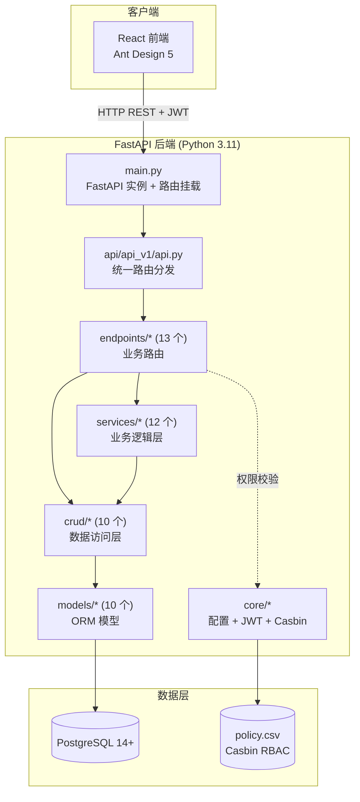
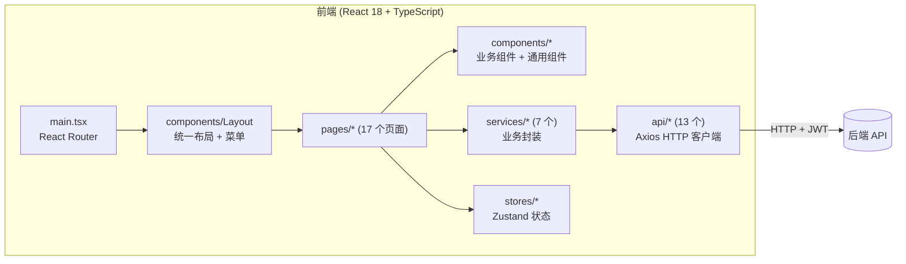
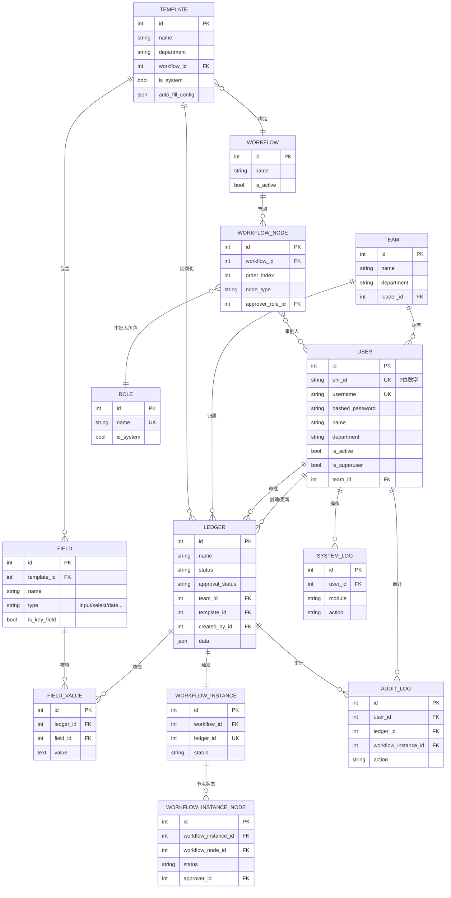

# 台账管理系统 - 整体架构

## 1.1 后端架构（FastAPI 分层）

```mermaid
flowchart TB
    subgraph Client["客户端"]
        FE["React 前端<br/>Ant Design 5"]
    end

    subgraph Backend["FastAPI 后端 (Python 3.11)"]
        direction TB
        Main["main.py<br/>FastAPI 实例 + 路由挂载"]
        API["api/api_v1/api.py<br/>统一路由分发"]
        Endpoints["endpoints/* (13 个)<br/>业务路由"]
        Services["services/* (12 个)<br/>业务逻辑层"]
        CRUD["crud/* (10 个)<br/>数据访问层"]
        Models["models/* (10 个)<br/>ORM 模型"]
        Core["core/*<br/>配置 + JWT + Casbin"]
    end

    subgraph DB["数据层"]
        PG[("PostgreSQL 14+")]
        CasbinPolicy[("policy.csv<br/>Casbin RBAC")]
    end

    FE -->|HTTP REST + JWT| Main
    Main --> API
    API --> Endpoints
    Endpoints --> Services
    Endpoints --> CRUD
    Services --> CRUD
    CRUD --> Models
    Models --> PG
    Endpoints -.->|权限校验| Core
    Core --> CasbinPolicy
```

## 1.2 前端架构（React + Ant Design）

```mermaid
flowchart LR
    subgraph FE["前端 (React 18 + TypeScript)"]
        direction TB
        Router["main.tsx<br/>React Router"]
        Layout["components/Layout<br/>统一布局 + 菜单"]
        Pages["pages/* (17 个页面)"]
        Components["components/*<br/>业务组件 + 通用组件"]
        API_Client["api/* (13 个)<br/>Axios HTTP 客户端"]
        Services_FE["services/* (7 个)<br/>业务封装"]
        Stores["stores/*<br/>Zustand 状态"]
    end

    Router --> Layout
    Layout --> Pages
    Pages --> Components
    Pages --> Services_FE
    Services_FE --> API_Client
    Pages --> Stores

    API_Client -->|HTTP + JWT| Backend[(后端 API)]
```

## 1.3 后端模型类关系（核心实体 ER 概览）

```mermaid
erDiagram
    USER ||--o{ LEDGER : "创建/更新"
    USER ||--o{ LEDGER : "审批"
    TEAM ||--o{ USER : "拥有"
    TEAM ||--o{ LEDGER : "归属"
    TEMPLATE ||--o{ LEDGER : "实例化"
    TEMPLATE ||--o{ FIELD : "包含"
    TEMPLATE }o--|| WORKFLOW : "绑定"
    LEDGER ||--o{ FIELD_VALUE : "填值"
    FIELD ||--o{ FIELD_VALUE : "被填"
    LEDGER ||--|| WORKFLOW_INSTANCE : "触发"
    WORKFLOW ||--o{ WORKFLOW_NODE : "节点"
    WORKFLOW_NODE }o--|| ROLE : "审批人角色"
    WORKFLOW_NODE }o--o{ USER : "审批人"
    WORKFLOW_INSTANCE ||--o{ WORKFLOW_INSTANCE_NODE : "节点状态"
    USER ||--o{ SYSTEM_LOG : "操作"
    USER ||--o{ AUDIT_LOG : "审计"
    LEDGER ||--o{ AUDIT_LOG : "审计"

    USER {
        int id PK
        string ehr_id UK "7位数字"
        string username UK
        string hashed_password
        string name
        string department
        bool is_active
        bool is_superuser
        int team_id FK
    }
    TEAM {
        int id PK
        string name
        string department
        int leader_id FK
    }
    LEDGER {
        int id PK
        string name
        string status
        string approval_status
        int team_id FK
        int template_id FK
        int created_by_id FK
        json data
    }
    TEMPLATE {
        int id PK
        string name
        string department
        int workflow_id FK
        bool is_system
        json auto_fill_config
    }
    FIELD {
        int id PK
        int template_id FK
        string name
        string type "input/select/date..."
        bool is_key_field
    }
    FIELD_VALUE {
        int id PK
        int ledger_id FK
        int field_id FK
        text value
    }
    WORKFLOW {
        int id PK
        string name
        bool is_active
    }
    WORKFLOW_NODE {
        int id PK
        int workflow_id FK
        int order_index
        string node_type
        int approver_role_id FK
    }
    WORKFLOW_INSTANCE {
        int id PK
        int workflow_id FK
        int ledger_id UK
        string status
    }
    WORKFLOW_INSTANCE_NODE {
        int id PK
        int workflow_instance_id FK
        int workflow_node_id FK
        string status
        int approver_id FK
    }
    ROLE {
        int id PK
        string name UK
        bool is_system
    }
    SYSTEM_LOG {
        int id PK
        int user_id FK
        string module
        string action
    }
    AUDIT_LOG {
        int id PK
        int user_id FK
        int ledger_id FK
        int workflow_instance_id FK
        string action
    }
```
