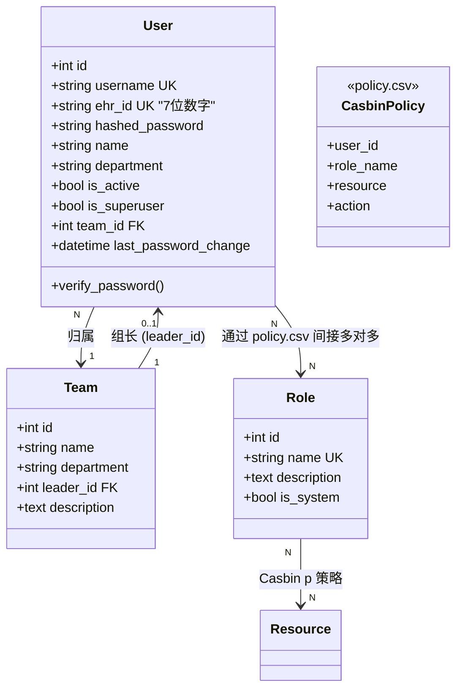
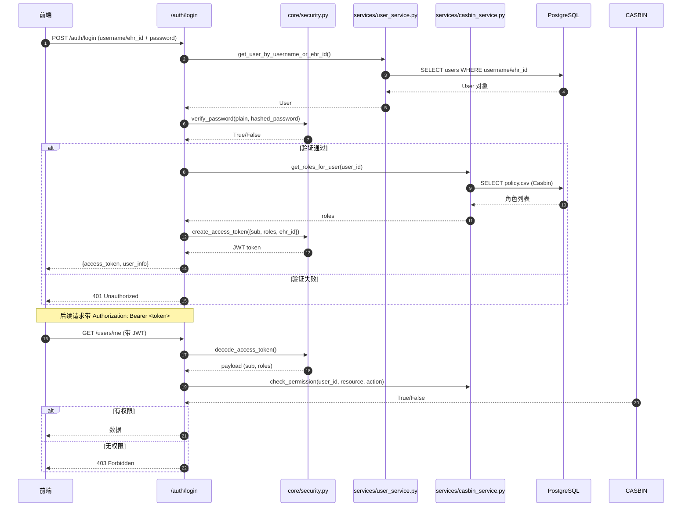
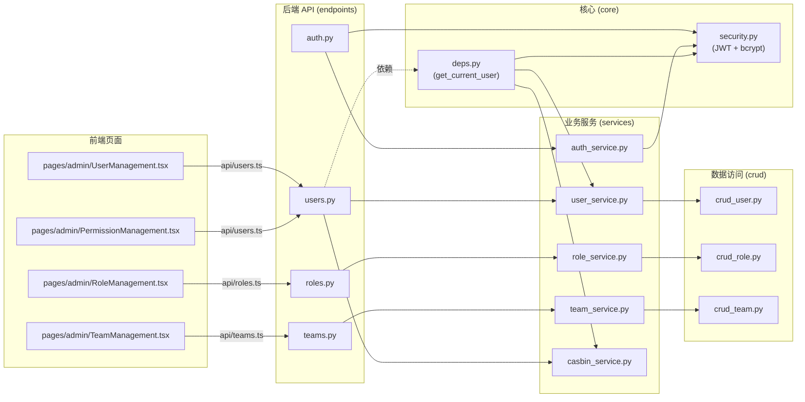

# 用户 / 角色 / 团队 / 权限 模块

## 2.1 类关系

## 2.2 鉴权流程（JWT + Casbin）

## 2.3 模块调用关系（API → Service → CRUD）

## 2.4 密码哈希算法（关键事实）

> ⚠️ **接入数字画像时必须注意**：台账用 **bcrypt**（`passlib.context.CryptContext(schemes=["bcrypt"])`），数字画像用 **PBKDF2-SHA256**。**算法不一致**，迁移用户时必须重哈希密码或强制重置。