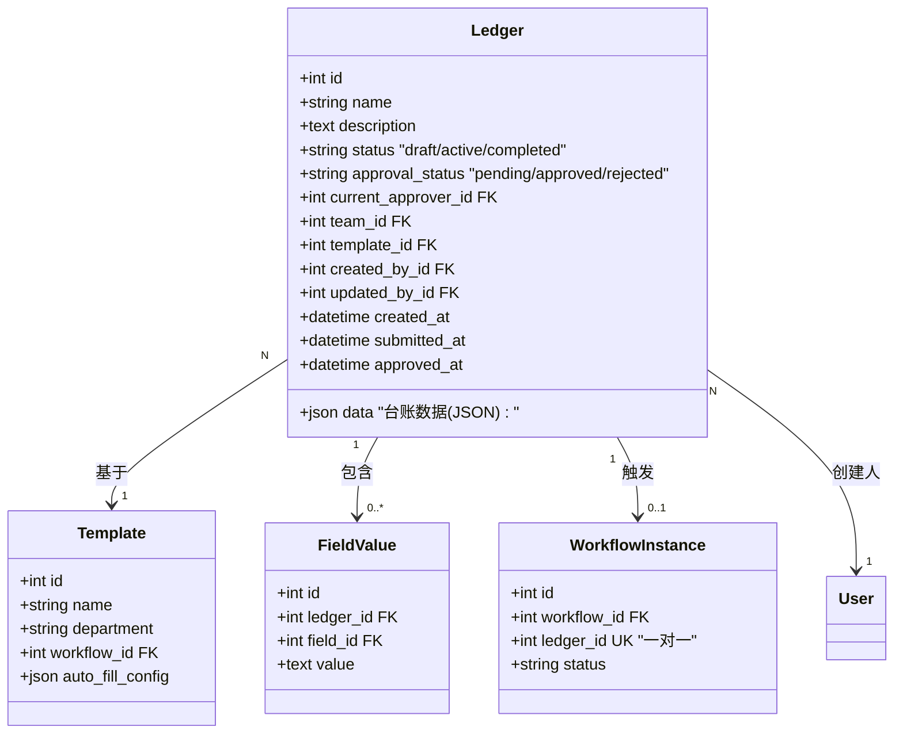
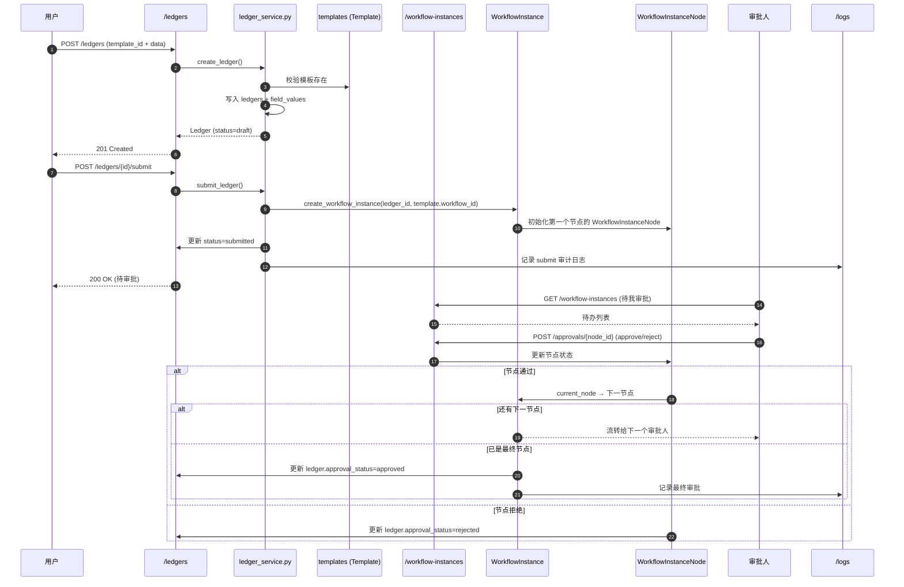
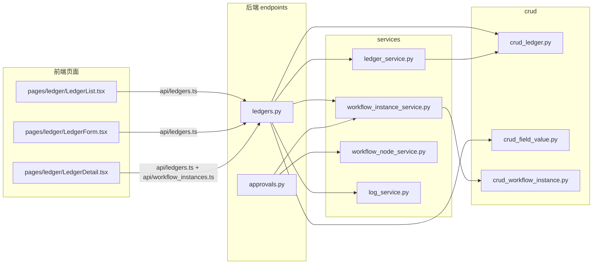

# 台账管理（Ledger）模块

## 3.1 类关系

```mermaid
classDiagram
    class Ledger {
        +int id
        +string name
        +text description
        +string status "draft/active/completed"
        +string approval_status "pending/approved/rejected"
        +int current_approver_id FK
        +int team_id FK
        +int template_id FK
        +int created_by_id FK
        +int updated_by_id FK
        +json data "台账数据(JSON)"
        +datetime created_at
        +datetime submitted_at
        +datetime approved_at
    }

    class Template {
        +int id
        +string name
        +string department
        +int workflow_id FK
        +json auto_fill_config
    }

    class FieldValue {
        +int id
        +int ledger_id FK
        +int field_id FK
        +text value
    }

    class WorkflowInstance {
        +int id
        +int workflow_id FK
        +int ledger_id UK "一对一"
        +string status
    }

    Ledger "N" --> "1" Template : 基于
    Ledger "1" --> "0..*" FieldValue : 包含
    Ledger "1" --> "0..1" WorkflowInstance : 触发
    Ledger "N" --> "1" User : 创建人
```

## 3.2 业务流程：台账创建 → 提交 → 审批

```mermaid
sequenceDiagram
    autonumber
    participant User as 用户
    participant LED_EP as /ledgers
    participant LED_SVC as ledger_service.py
    participant TMPL as templates (Template)
    participant WF as /workflow-instances
    participant WFI as WorkflowInstance
    participant Node as WorkflowInstanceNode
    participant Approver as 审批人
    participant LOG as /logs

    User->>LED_EP: POST /ledgers (template_id + data)
    LED_EP->>LED_SVC: create_ledger()
    LED_SVC->>TMPL: 校验模板存在
    LED_SVC->>LED_SVC: 写入 ledgers + field_values
    LED_SVC-->>LED_EP: Ledger (status=draft)
    LED_EP-->>User: 201 Created

    User->>LED_EP: POST /ledgers/{id}/submit
    LED_EP->>LED_SVC: submit_ledger()
    LED_SVC->>WFI: create_workflow_instance(ledger_id, template.workflow_id)
    WFI->>Node: 初始化第一个节点的 WorkflowInstanceNode
    LED_SVC->>LED_EP: 更新 status=submitted
    LED_SVC->>LOG: 记录 submit 审计日志
    LED_EP-->>User: 200 OK (待审批)

    Approver->>WF: GET /workflow-instances (待我审批)
    WF-->>Approver: 待办列表
    Approver->>WF: POST /approvals/{node_id} (approve/reject)
    WF->>Node: 更新节点状态
    alt 节点通过
        Node->>WFI: current_node → 下一节点
        alt 还有下一节点
            WFI-->>Approver: 流转给下一个审批人
        else 已是最终节点
            WFI->>LED_EP: 更新 ledger.approval_status=approved
            WFI->>LOG: 记录最终审批
        end
    else 节点拒绝
        Node->>LED_EP: 更新 ledger.approval_status=rejected
    end
```

## 3.3 模块调用关系

```mermaid
flowchart LR
    subgraph FE_Pages["前端页面"]
        LL["pages/ledger/LedgerList.tsx"]
        LF["pages/ledger/LedgerForm.tsx"]
        LD["pages/ledger/LedgerDetail.tsx"]
    end

    subgraph BE_API["后端 endpoints"]
        L_EP["ledgers.py"]
        AP_EP["approvals.py"]
    end

    subgraph BE_Service["services"]
        LS["ledger_service.py"]
        WS["workflow_instance_service.py"]
        WNS["workflow_node_service.py"]
        LOG_S["log_service.py"]
    end

    subgraph BE_CRUD["crud"]
        C_L["crud_ledger.py"]
        C_FV["crud_field_value.py"]
        C_WF["crud_workflow_instance.py"]
    end

    LL -->|api/ledgers.ts| L_EP
    LF -->|api/ledgers.ts| L_EP
    LD -->|api/ledgers.ts + api/workflow_instances.ts| L_EP

    L_EP --> LS
    L_EP --> C_L
    L_EP --> C_FV
    L_EP --> WS
    L_EP --> LOG_S

    AP_EP --> WNS
    AP_EP --> WS

    LS --> C_L
    WS --> C_WF
```