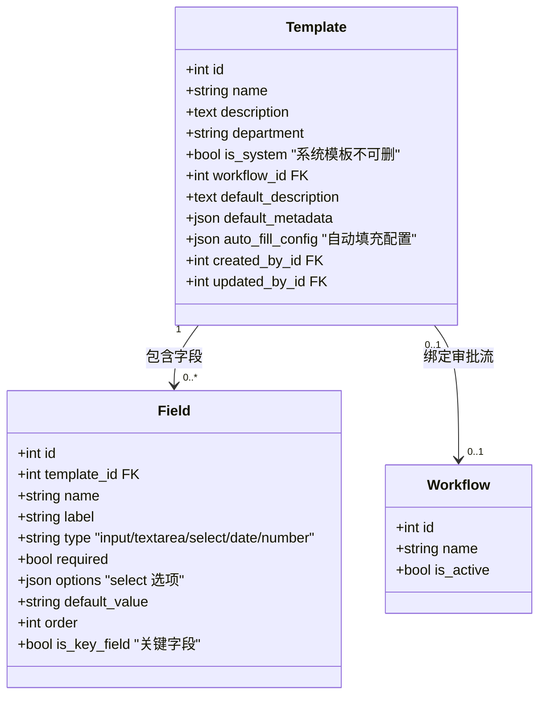
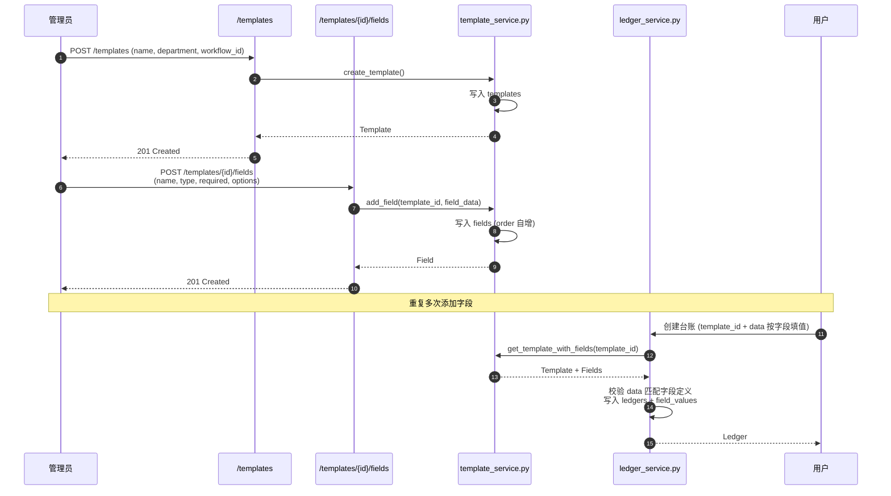
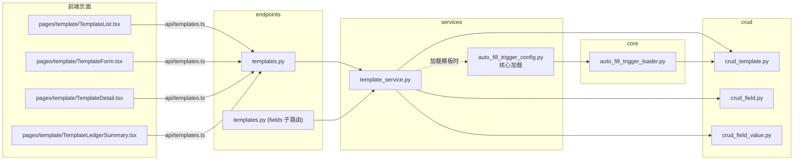
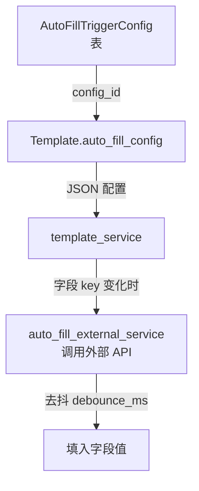

# 模板管理（Template）模块

## 4.1 类关系

```mermaid
classDiagram
    class Template {
        +int id
        +string name
        +text description
        +string department
        +bool is_system "系统模板不可删"
        +int workflow_id FK
        +text default_description
        +json default_metadata
        +json auto_fill_config "自动填充配置"
        +int created_by_id FK
        +int updated_by_id FK
    }

    class Field {
        +int id
        +int template_id FK
        +string name
        +string label
        +string type "input/textarea/select/date/number"
        +bool required
        +json options "select 选项"
        +string default_value
        +int order
        +bool is_key_field "关键字段"
    }

    class Workflow {
        +int id
        +string name
        +bool is_active
    }

    Template "1" --> "0..*" Field : 包含字段
    Template "0..1" --> "0..1" Workflow : 绑定审批流
```

## 4.2 模板创建 → 字段配置 → 业务使用流程

```mermaid
sequenceDiagram
    autonumber
    participant Admin as 管理员
    participant T_EP as /templates
    participant F_EP as /templates/{id}/fields
    participant TS as template_service.py
    participant LS as ledger_service.py
    participant User as 用户

    Admin->>T_EP: POST /templates (name, department, workflow_id)
    T_EP->>TS: create_template()
    TS->>TS: 写入 templates
    TS-->>T_EP: Template
    T_EP-->>Admin: 201 Created

    Admin->>F_EP: POST /templates/{id}/fields<br/>(name, type, required, options)
    F_EP->>TS: add_field(template_id, field_data)
    TS->>TS: 写入 fields (order 自增)
    TS-->>F_EP: Field
    F_EP-->>Admin: 201 Created

    Note over Admin,User: 重复多次添加字段

    User->>LS: 创建台账 (template_id + data 按字段填值)
    LS->>TS: get_template_with_fields(template_id)
    TS-->>LS: Template + Fields
    LS->>LS: 校验 data 匹配字段定义<br/>写入 ledgers + field_values
    LS-->>User: Ledger
```

## 4.3 模块调用关系

```mermaid
flowchart LR
    subgraph FE_Pages["前端页面"]
        TL["pages/template/TemplateList.tsx"]
        TF["pages/template/TemplateForm.tsx"]
        TD["pages/template/TemplateDetail.tsx"]
        TS["pages/template/TemplateLedgerSummary.tsx"]
    end

    subgraph BE_API["endpoints"]
        T_EP["templates.py"]
        F_EP["templates.py (fields 子路由)"]
    end

    subgraph BE_Service["services"]
        TS_S["template_service.py"]
        FCS["auto_fill_trigger_config.py<br/>核心加载"]
    end

    subgraph BE_CRUD["crud"]
        C_T["crud_template.py"]
        C_F["crud_field.py"]
        C_FV["crud_field_value.py"]
    end

    subgraph BE_Core["core"]
        AFTC["auto_fill_trigger_loader.py"]
    end

    TL -->|api/templates.ts| T_EP
    TF -->|api/templates.ts| T_EP
    TD -->|api/templates.ts| T_EP
    TS -->|api/templates.ts| T_EP

    T_EP --> TS_S
    F_EP --> TS_S

    TS_S --> C_T
    TS_S --> C_F
    TS_S --> C_FV

    TS_S -.->|加载模板时| FCS
    FCS --> AFTC
    AFTC --> C_T
```

## 4.4 自动填充机制

```mermaid
flowchart TB
    AFTC[AutoFillTriggerConfig<br/>表] -->|config_id| L[Template.auto_fill_config]
    L -->|JSON 配置| TS_SVC[template_service]
    TS_SVC -->|字段 key 变化时| API[auto_fill_external_service<br/>调用外部 API]
    API -->|去抖 debounce_ms| Result[填入字段值]
```