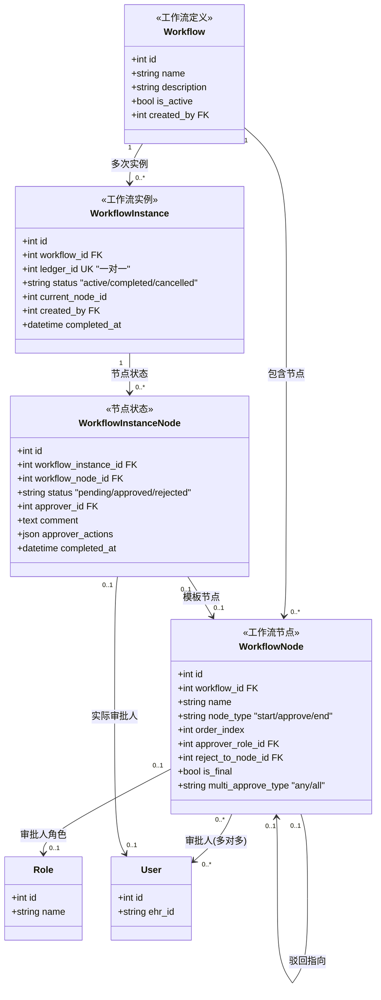
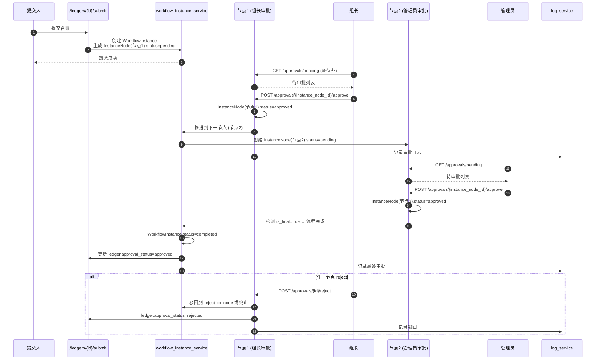
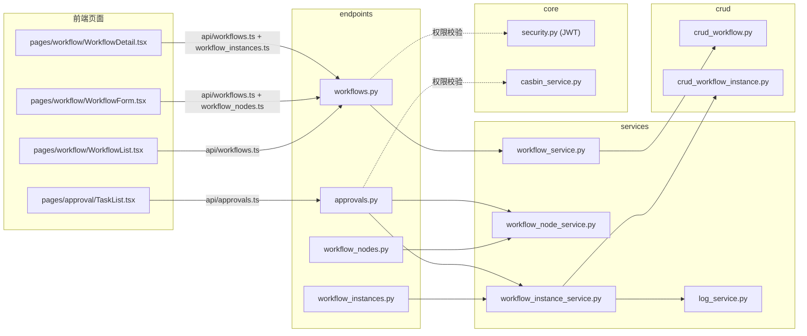

# 工作流审批（Workflow）模块

## 5.1 4 级抽象类图

```mermaid
classDiagram
    class Workflow {
        <<工作流定义>>
        +int id
        +string name
        +string description
        +bool is_active
        +int created_by FK
    }

    class WorkflowNode {
        <<工作流节点>>
        +int id
        +int workflow_id FK
        +string name
        +string node_type "start/approve/end"
        +int order_index
        +int approver_role_id FK
        +int reject_to_node_id FK
        +bool is_final
        +string multi_approve_type "any/all"
    }

    class WorkflowInstance {
        <<工作流实例>>
        +int id
        +int workflow_id FK
        +int ledger_id UK "一对一"
        +string status "active/completed/cancelled"
        +int current_node_id
        +int created_by FK
        +datetime completed_at
    }

    class WorkflowInstanceNode {
        <<节点状态>>
        +int id
        +int workflow_instance_id FK
        +int workflow_node_id FK
        +string status "pending/approved/rejected"
        +int approver_id FK
        +text comment
        +json approver_actions
        +datetime completed_at
    }

    class Role {
        +int id
        +string name
    }

    class User {
        +int id
        +string ehr_id
    }

    Workflow "1" --> "0..*" WorkflowNode : 包含节点
    WorkflowNode "0..1" --> "0..1" Role : 审批人角色
    WorkflowNode "0..*" --> "0..*" User : 审批人(多对多)
    WorkflowNode "0..1" --> "0..1" WorkflowNode : 驳回指向
    Workflow "1" --> "0..*" WorkflowInstance : 多次实例
    WorkflowInstance "1" --> "0..*" WorkflowInstanceNode : 节点状态
    WorkflowInstanceNode "0..1" --> "0..1" WorkflowNode : 模板节点
    WorkflowInstanceNode "0..1" --> "0..1" User : 实际审批人
```

## 5.2 多级审批流转（sequenceDiagram）

```mermaid
sequenceDiagram
    autonumber
    participant User as 提交人
    participant LED as /ledgers/{id}/submit
    participant WFI as workflow_instance_service
    participant N1 as 节点1 (组长审批)
    participant L1 as 组长
    participant N2 as 节点2 (管理员审批)
    participant L2 as 管理员
    participant LOG as log_service

    User->>LED: 提交台账
    LED->>WFI: 创建 WorkflowInstance<br/>生成 InstanceNode(节点1) status=pending
    WFI-->>User: 提交成功

    L1->>N1: GET /approvals/pending (查待办)
    N1-->>L1: 待审批列表
    L1->>N1: POST /approvals/{instance_node_id}/approve
    N1->>N1: InstanceNode(节点1).status=approved
    N1->>WFI: 推进到下一节点 (节点2)
    WFI->>N2: 创建 InstanceNode(节点2) status=pending
    N1->>LOG: 记录审批日志

    L2->>N2: GET /approvals/pending
    N2-->>L2: 待审批列表
    L2->>N2: POST /approvals/{instance_node_id}/approve
    N2->>N2: InstanceNode(节点2).status=approved
    N2->>WFI: 检测 is_final=true → 流程完成
    WFI->>WFI: WorkflowInstance.status=completed
    WFI->>LED: 更新 ledger.approval_status=approved
    WFI->>LOG: 记录最终审批

    alt 任一节点 reject
        L1->>N1: POST /approvals/{id}/reject
        N1->>WFI: 驳回到 reject_to_node 或终止
        N1->>LED: ledger.approval_status=rejected
        N1->>LOG: 记录驳回
    end
```

## 5.3 模块调用关系

```mermaid
flowchart LR
    subgraph FE_Pages["前端页面"]
        WL["pages/workflow/WorkflowList.tsx"]
        WF["pages/workflow/WorkflowForm.tsx"]
        WDT["pages/workflow/WorkflowDetail.tsx"]
        TL["pages/approval/TaskList.tsx"]
    end

    subgraph BE_API["endpoints"]
        W_EP["workflows.py"]
        WN_EP["workflow_nodes.py"]
        WI_EP["workflow_instances.py"]
        A_EP["approvals.py"]
    end

    subgraph BE_Service["services"]
        WS["workflow_service.py"]
        WNS["workflow_node_service.py"]
        WIS["workflow_instance_service.py"]
        LS["log_service.py"]
    end

    subgraph BE_Core["core"]
        SEC["security.py (JWT)"]
        CS["casbin_service.py"]
    end

    subgraph BE_CRUD["crud"]
        C_WF["crud_workflow.py"]
        C_WFI["crud_workflow_instance.py"]
    end

    WL -->|api/workflows.ts| W_EP
    WF -->|api/workflows.ts + workflow_nodes.ts| W_EP
    WDT -->|api/workflows.ts + workflow_instances.ts| W_EP
    TL -->|api/approvals.ts| A_EP

    W_EP --> WS
    WN_EP --> WNS
    WI_EP --> WIS
    A_EP --> WIS
    A_EP --> WNS

    WS --> C_WF
    WIS --> C_WFI
    WIS --> LS

    W_EP -.->|权限校验| SEC
    A_EP -.->|权限校验| CS
```