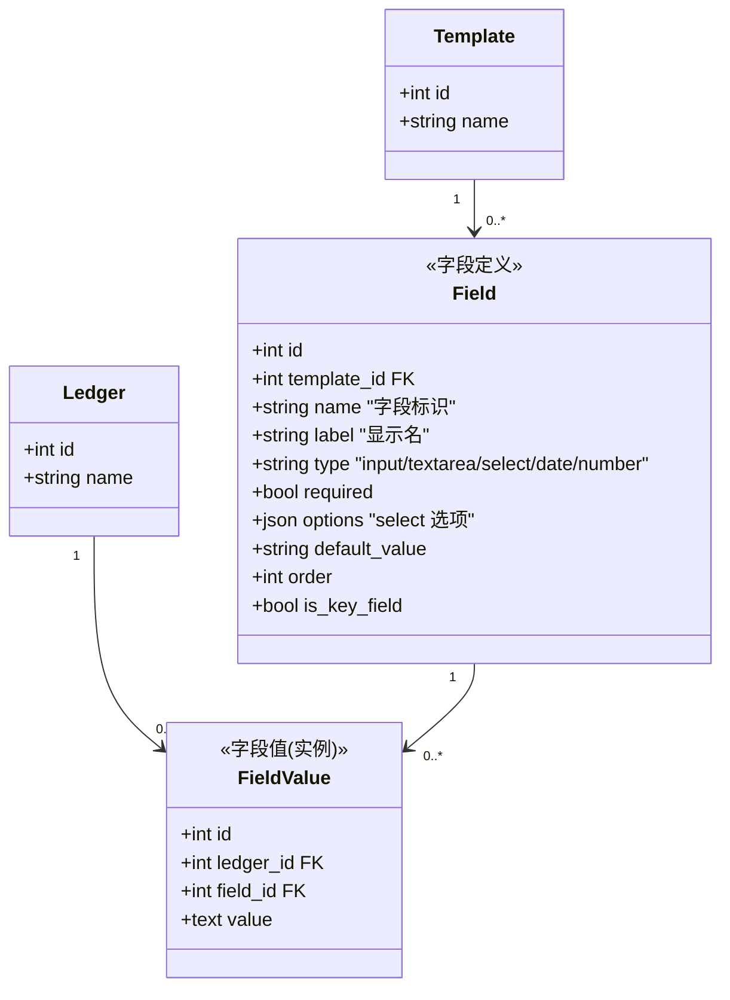
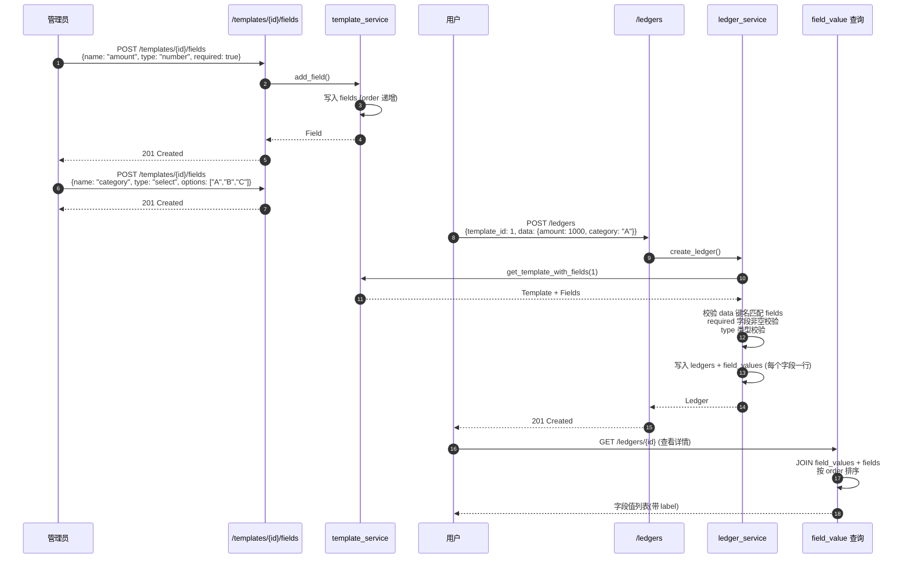
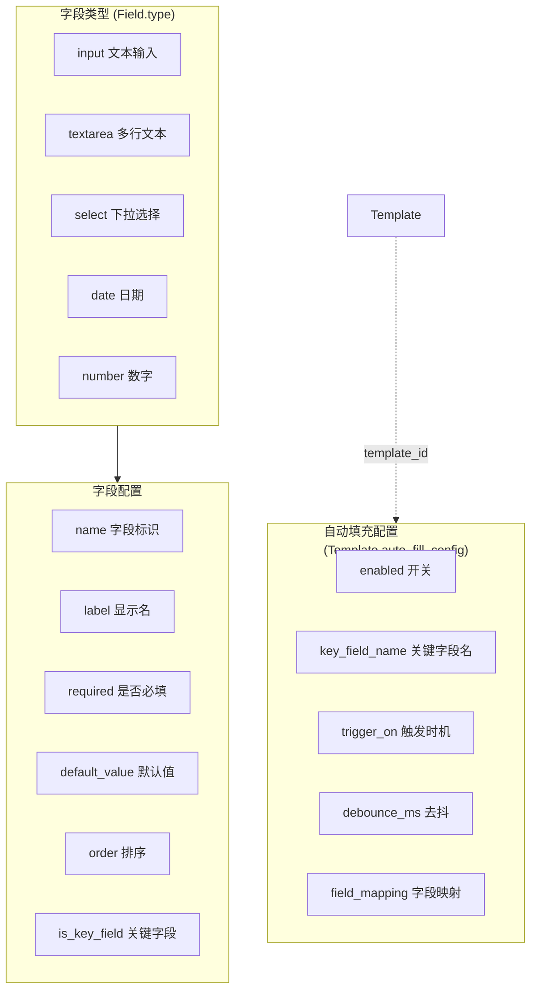
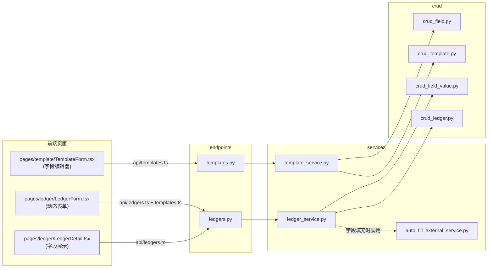

# 字段管理（Field / FieldValue）模块

## 6.1 类关系

```mermaid
classDiagram
    class Template {
        +int id
        +string name
    }

    class Field {
        <<字段定义>>
        +int id
        +int template_id FK
        +string name "字段标识"
        +string label "显示名"
        +string type "input/textarea/select/date/number"
        +bool required
        +json options "select 选项"
        +string default_value
        +int order
        +bool is_key_field
    }

    class FieldValue {
        <<字段值(实例)>>
        +int id
        +int ledger_id FK
        +int field_id FK
        +text value
    }

    class Ledger {
        +int id
        +string name
    }

    Template "1" --> "0..*" Field
    Ledger "1" --> "0..*" FieldValue
    Field "1" --> "0..*" FieldValue
```

## 6.2 字段定义 → 字段填值 → 字段查询流程

```mermaid
sequenceDiagram
    autonumber
    participant Admin as 管理员
    participant T_EP as /templates/{id}/fields
    participant TS as template_service
    participant User as 用户
    participant L_EP as /ledgers
    participant LS as ledger_service
    participant FV_SVC as field_value 查询

    Admin->>T_EP: POST /templates/{id}/fields<br/>{name: "amount", type: "number", required: true}
    T_EP->>TS: add_field()
    TS->>TS: 写入 fields (order 递增)
    TS-->>T_EP: Field
    T_EP-->>Admin: 201 Created

    Admin->>T_EP: POST /templates/{id}/fields<br/>{name: "category", type: "select", options: ["A","B","C"]}
    T_EP-->>Admin: 201 Created

    User->>L_EP: POST /ledgers<br/>{template_id: 1, data: {amount: 1000, category: "A"}}
    L_EP->>LS: create_ledger()
    LS->>TS: get_template_with_fields(1)
    TS-->>LS: Template + Fields
    LS->>LS: 校验 data 键名匹配 fields<br/>required 字段非空校验<br/>type 类型校验
    LS->>LS: 写入 ledgers + field_values (每个字段一行)
    LS-->>L_EP: Ledger
    L_EP-->>User: 201 Created

    User->>FV_SVC: GET /ledgers/{id} (查看详情)
    FV_SVC->>FV_SVC: JOIN field_values + fields<br/>按 order 排序
    FV_SVC-->>User: 字段值列表(带 label)
```

## 6.3 字段类型与配置

```mermaid
flowchart TB
    subgraph FieldTypes["字段类型 (Field.type)"]
        T1[input 文本输入]
        T2[textarea 多行文本]
        T3[select 下拉选择]
        T4[date 日期]
        T5[number 数字]
    end

    subgraph FieldConfig["字段配置"]
        F1[name 字段标识]
        F2[label 显示名]
        F3[required 是否必填]
        F4[default_value 默认值]
        F5[order 排序]
        F6[is_key_field 关键字段]
    end

    subgraph AutoFill["自动填充配置<br/>(Template.auto_fill_config)"]
        AF1[enabled 开关]
        AF2[key_field_name 关键字段名]
        AF3[trigger_on 触发时机]
        AF4[debounce_ms 去抖]
        AF5[field_mapping 字段映射]
    end

    FieldTypes --> FieldConfig
    Template -.->|template_id| AutoFill
```

## 6.4 模块调用关系

```mermaid
flowchart LR
    subgraph FE_Pages["前端页面"]
        TF["pages/template/TemplateForm.tsx<br/>(字段编辑器)"]
        LF["pages/ledger/LedgerForm.tsx<br/>(动态表单)"]
        LD["pages/ledger/LedgerDetail.tsx<br/>(字段展示)"]
    end

    subgraph BE_API["endpoints"]
        T_EP["templates.py"]
        L_EP["ledgers.py"]
    end

    subgraph BE_Service["services"]
        TS_S["template_service.py"]
        LS["ledger_service.py"]
        AFE["auto_fill_external_service.py"]
    end

    subgraph BE_CRUD["crud"]
        C_F["crud_field.py"]
        C_FV["crud_field_value.py"]
        C_T["crud_template.py"]
        C_L["crud_ledger.py"]
    end

    TF -->|api/templates.ts| T_EP
    LF -->|api/ledgers.ts + templates.ts| L_EP
    LD -->|api/ledgers.ts| L_EP

    T_EP --> TS_S
    L_EP --> LS

    TS_S --> C_F
    TS_S --> C_T
    LS --> C_FV
    LS --> C_L
    LS -.->|字段填充时调用| AFE
```