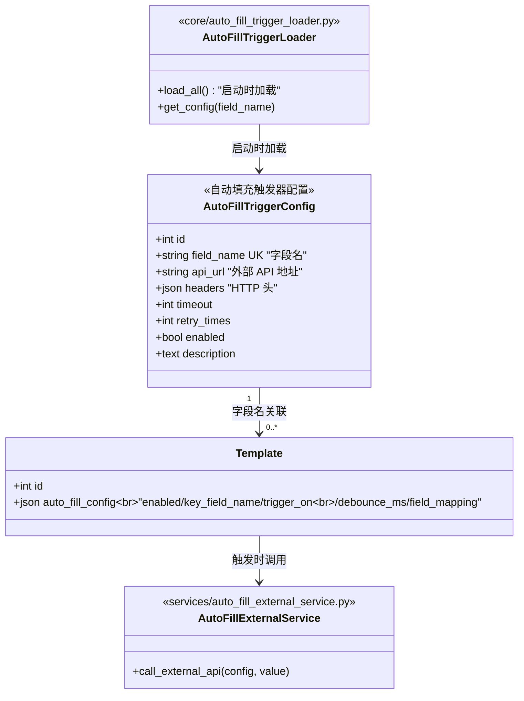
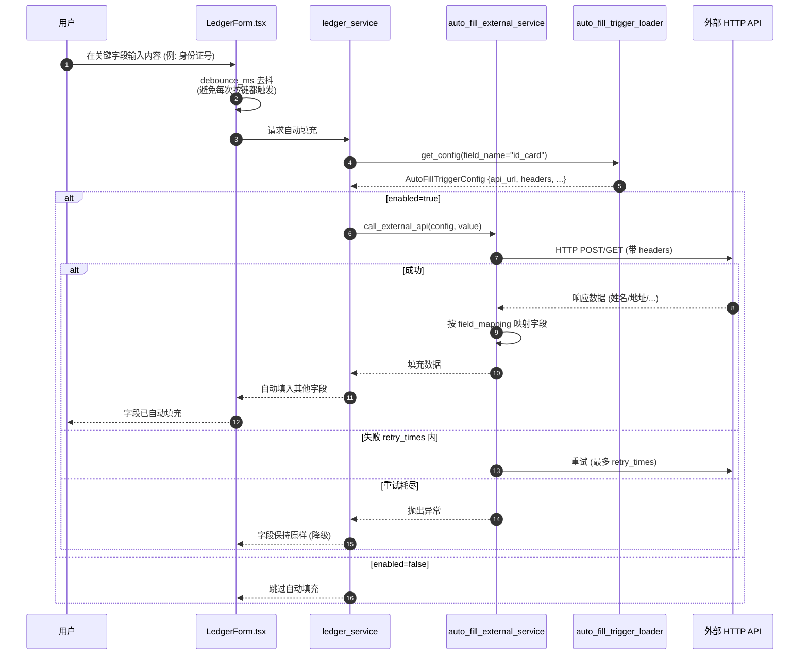
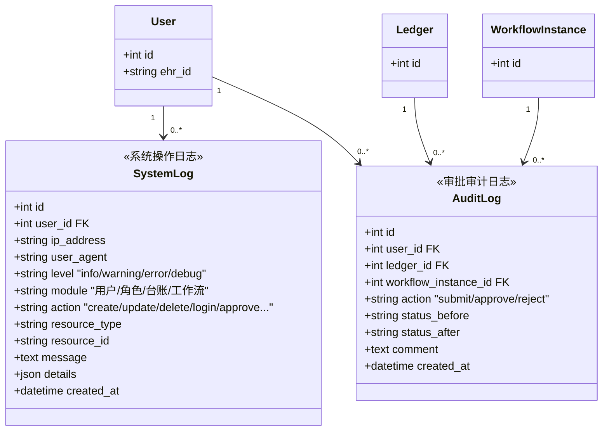
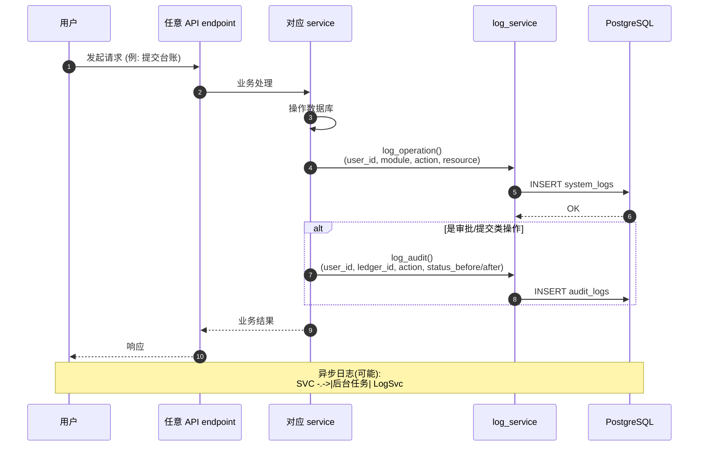
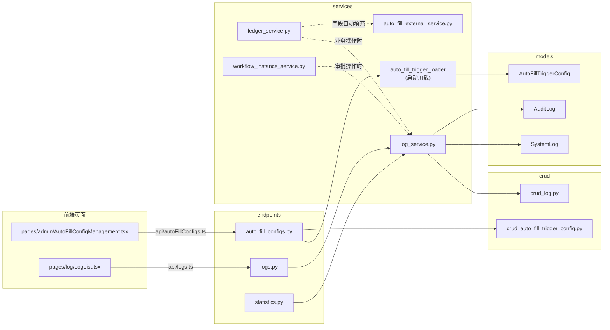

# 自动填充配置 + 日志模块

## 7.1 自动填充模块类关系

```mermaid
classDiagram
    class AutoFillTriggerConfig {
        <<自动填充触发器配置>>
        +int id
        +string field_name UK "字段名"
        +string api_url "外部 API 地址"
        +json headers "HTTP 头"
        +int timeout
        +int retry_times
        +bool enabled
        +text description
    }

    class Template {
        +int id
        +json auto_fill_config<br/>"enabled/key_field_name/trigger_on<br/>/debounce_ms/field_mapping"
    }

    class AutoFillTriggerLoader {
        <<core/auto_fill_trigger_loader.py>>
        +load_all() "启动时加载"
        +get_config(field_name)
    }

    class AutoFillExternalService {
        <<services/auto_fill_external_service.py>>
        +call_external_api(config, value)
    }

    AutoFillTriggerConfig "1" --> "0..*" Template : 字段名关联
    AutoFillTriggerLoader --> AutoFillTriggerConfig : 启动时加载
    Template --> AutoFillExternalService : 触发时调用
```

## 7.2 自动填充触发流程

```mermaid
sequenceDiagram
    autonumber
    participant User as 用户
    participant Form as LedgerForm.tsx
    participant LS as ledger_service
    participant AFE as auto_fill_external_service
    participant Loader as auto_fill_trigger_loader
    participant ExtAPI as 外部 HTTP API

    User->>Form: 在关键字段输入内容 (例: 身份证号)
    Form->>Form: debounce_ms 去抖<br/>(避免每次按键都触发)
    Form->>LS: 请求自动填充
    LS->>Loader: get_config(field_name="id_card")
    Loader-->>LS: AutoFillTriggerConfig {api_url, headers, ...}

    alt enabled=true
        LS->>AFE: call_external_api(config, value)
        AFE->>ExtAPI: HTTP POST/GET (带 headers)
        alt 成功
            ExtAPI-->>AFE: 响应数据 (姓名/地址/...)
            AFE->>AFE: 按 field_mapping 映射字段
            AFE-->>LS: 填充数据
            LS-->>Form: 自动填入其他字段
            Form-->>User: 字段已自动填充
        else 失败 retry_times 内
            AFE->>ExtAPI: 重试 (最多 retry_times)
        else 重试耗尽
            AFE-->>LS: 抛出异常
            LS-->>Form: 字段保持原样 (降级)
        end
    else enabled=false
        LS-->>Form: 跳过自动填充
    end
```

## 7.3 日志模块类关系

```mermaid
classDiagram
    class SystemLog {
        <<系统操作日志>>
        +int id
        +int user_id FK
        +string ip_address
        +string user_agent
        +string level "info/warning/error/debug"
        +string module "用户/角色/台账/工作流"
        +string action "create/update/delete/login/approve..."
        +string resource_type
        +string resource_id
        +text message
        +json details
        +datetime created_at
    }

    class AuditLog {
        <<审批审计日志>>
        +int id
        +int user_id FK
        +int ledger_id FK
        +int workflow_instance_id FK
        +string action "submit/approve/reject"
        +string status_before
        +string status_after
        +text comment
        +datetime created_at
    }

    class User {
        +int id
        +string ehr_id
    }

    class Ledger {
        +int id
    }

    class WorkflowInstance {
        +int id
    }

    User "1" --> "0..*" SystemLog
    User "1" --> "0..*" AuditLog
    Ledger "1" --> "0..*" AuditLog
    WorkflowInstance "1" --> "0..*" AuditLog
```

## 7.4 日志记录流程

```mermaid
sequenceDiagram
    autonumber
    participant User as 用户
    participant API as 任意 API endpoint
    participant SVC as 对应 service
    participant LogSvc as log_service
    participant DB as PostgreSQL

    User->>API: 发起请求 (例: 提交台账)
    API->>SVC: 业务处理
    SVC->>SVC: 操作数据库
    SVC->>LogSvc: log_operation()<br/>(user_id, module, action, resource)
    LogSvc->>DB: INSERT system_logs
    DB-->>LogSvc: OK

    alt 是审批/提交类操作
        SVC->>LogSvc: log_audit()<br/>(user_id, ledger_id, action, status_before/after)
        LogSvc->>DB: INSERT audit_logs
    end

    SVC-->>API: 业务结果
    API-->>User: 响应

    Note over User,DB: 异步日志(可能):<br/>SVC -.->|后台任务| LogSvc
```

## 7.5 模块调用关系

```mermaid
flowchart LR
    subgraph FE_Pages["前端页面"]
        AFC["pages/admin/AutoFillConfigManagement.tsx"]
        LL["pages/log/LogList.tsx"]
    end

    subgraph BE_API["endpoints"]
        AF_EP["auto_fill_configs.py"]
        LOG_EP["logs.py"]
        STAT_EP["statistics.py"]
    end

    subgraph BE_Service["services"]
        AFE_S["auto_fill_external_service.py"]
        LOG_S["log_service.py"]
        AFTL["auto_fill_trigger_loader<br/>(启动加载)"]
        LS["ledger_service.py"]
        WS["workflow_instance_service.py"]
    end

    subgraph BE_CRUD["crud"]
        C_AFTC["crud_auto_fill_trigger_config.py"]
        C_LOG["crud_log.py"]
    end

    subgraph Models["models"]
        M_AFTC["AutoFillTriggerConfig"]
        M_SL["SystemLog"]
        M_AL["AuditLog"]
    end

    AFC -->|api/autoFillConfigs.ts| AF_EP
    LL -->|api/logs.ts| LOG_EP

    AF_EP --> AFTL
    AF_EP --> C_AFTC

    LOG_EP --> LOG_S
    LOG_S --> C_LOG

    STAT_EP --> LOG_S

    LS -.->|业务操作时| LOG_S
    WS -.->|审批操作时| LOG_S
    LS -.->|字段自动填充| AFE_S

    AFTL --> M_AFTC
    LOG_S --> M_SL
    LOG_S --> M_AL
```