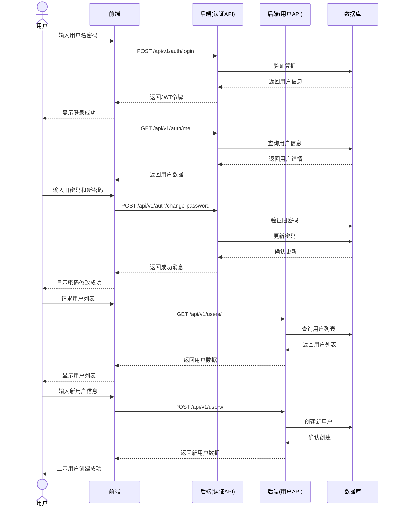
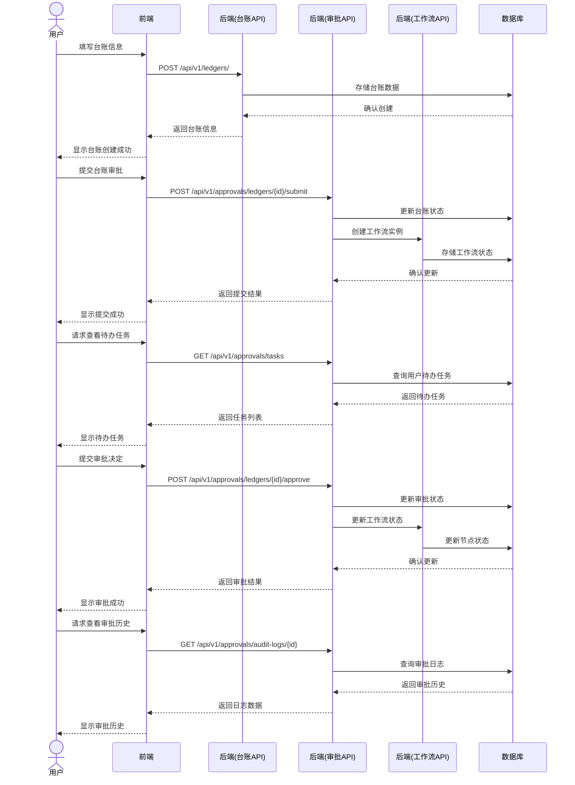
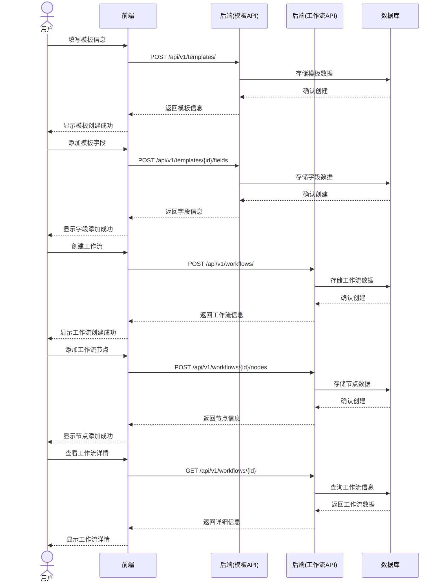
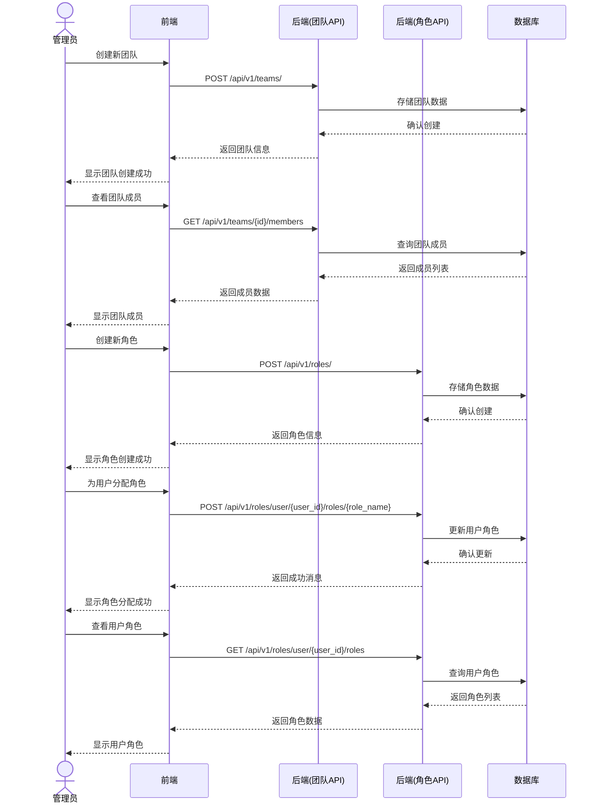

# API调用流程图

## 1. 认证与用户管理API流程

```mermaid
sequenceDiagram
    actor User as 用户
    participant FE as 前端
    participant BE_Auth as 后端(认证API)
    participant BE_User as 后端(用户API)
    participant DB as 数据库
    
    %% 登录流程
    User->>FE: 输入用户名密码
    FE->>BE_Auth: POST /api/v1/auth/login
    BE_Auth->>DB: 验证凭据
    DB-->>BE_Auth: 返回用户信息
    BE_Auth-->>FE: 返回JWT令牌
    FE-->>User: 显示登录成功
    
    %% 获取用户信息
    FE->>BE_Auth: GET /api/v1/auth/me
    BE_Auth->>DB: 查询用户信息
    DB-->>BE_Auth: 返回用户详情
    BE_Auth-->>FE: 返回用户数据
    
    %% 修改密码
    User->>FE: 输入旧密码和新密码
    FE->>BE_Auth: POST /api/v1/auth/change-password
    BE_Auth->>DB: 验证旧密码
    BE_Auth->>DB: 更新密码
    DB-->>BE_Auth: 确认更新
    BE_Auth-->>FE: 返回成功消息
    FE-->>User: 显示密码修改成功
    
    %% 用户管理
    User->>FE: 请求用户列表
    FE->>BE_User: GET /api/v1/users/
    BE_User->>DB: 查询用户列表
    DB-->>BE_User: 返回用户列表
    BE_User-->>FE: 返回用户数据
    FE-->>User: 显示用户列表
    
    %% 创建用户
    User->>FE: 输入新用户信息
    FE->>BE_User: POST /api/v1/users/
    BE_User->>DB: 创建新用户
    DB-->>BE_User: 确认创建
    BE_User-->>FE: 返回新用户数据
    FE-->>User: 显示用户创建成功
```

## 2. 台账与审批API流程

```mermaid
sequenceDiagram
    actor User as 用户
    participant FE as 前端
    participant BE_Ledger as 后端(台账API)
    participant BE_Approval as 后端(审批API)
    participant BE_Workflow as 后端(工作流API)
    participant DB as 数据库
    
    %% 创建台账
    User->>FE: 填写台账信息
    FE->>BE_Ledger: POST /api/v1/ledgers/
    BE_Ledger->>DB: 存储台账数据
    DB-->>BE_Ledger: 确认创建
    BE_Ledger-->>FE: 返回台账信息
    FE-->>User: 显示台账创建成功
    
    %% 提交审批
    User->>FE: 提交台账审批
    FE->>BE_Approval: POST /api/v1/approvals/ledgers/{id}/submit
    BE_Approval->>DB: 更新台账状态
    BE_Approval->>BE_Workflow: 创建工作流实例
    BE_Workflow->>DB: 存储工作流状态
    DB-->>BE_Approval: 确认更新
    BE_Approval-->>FE: 返回提交结果
    FE-->>User: 显示提交成功
    
    %% 获取待办任务
    User->>FE: 请求查看待办任务
    FE->>BE_Approval: GET /api/v1/approvals/tasks
    BE_Approval->>DB: 查询用户待办任务
    DB-->>BE_Approval: 返回待办任务
    BE_Approval-->>FE: 返回任务列表
    FE-->>User: 显示待办任务
    
    %% 审批处理
    User->>FE: 提交审批决定
    FE->>BE_Approval: POST /api/v1/approvals/ledgers/{id}/approve
    BE_Approval->>DB: 更新审批状态
    BE_Approval->>BE_Workflow: 更新工作流状态
    BE_Workflow->>DB: 更新节点状态
    DB-->>BE_Approval: 确认更新
    BE_Approval-->>FE: 返回审批结果
    FE-->>User: 显示审批成功
    
    %% 查看审批历史
    User->>FE: 请求查看审批历史
    FE->>BE_Approval: GET /api/v1/approvals/audit-logs/{id}
    BE_Approval->>DB: 查询审批日志
    DB-->>BE_Approval: 返回审批历史
    BE_Approval-->>FE: 返回日志数据
    FE-->>User: 显示审批历史
```

## 3. 模板与工作流API流程

```mermaid
sequenceDiagram
    actor User as 用户
    participant FE as 前端
    participant BE_Template as 后端(模板API)
    participant BE_Workflow as 后端(工作流API)
    participant DB as 数据库
    
    %% 创建模板
    User->>FE: 填写模板信息
    FE->>BE_Template: POST /api/v1/templates/
    BE_Template->>DB: 存储模板数据
    DB-->>BE_Template: 确认创建
    BE_Template-->>FE: 返回模板信息
    FE-->>User: 显示模板创建成功
    
    %% 添加字段
    User->>FE: 添加模板字段
    FE->>BE_Template: POST /api/v1/templates/{id}/fields
    BE_Template->>DB: 存储字段数据
    DB-->>BE_Template: 确认创建
    BE_Template-->>FE: 返回字段信息
    FE-->>User: 显示字段添加成功
    
    %% 创建工作流
    User->>FE: 创建工作流
    FE->>BE_Workflow: POST /api/v1/workflows/
    BE_Workflow->>DB: 存储工作流数据
    DB-->>BE_Workflow: 确认创建
    BE_Workflow-->>FE: 返回工作流信息
    FE-->>User: 显示工作流创建成功
    
    %% 添加工作流节点
    User->>FE: 添加工作流节点
    FE->>BE_Workflow: POST /api/v1/workflows/{id}/nodes
    BE_Workflow->>DB: 存储节点数据
    DB-->>BE_Workflow: 确认创建
    BE_Workflow-->>FE: 返回节点信息
    FE-->>User: 显示节点添加成功
    
    %% 获取工作流详情
    User->>FE: 查看工作流详情
    FE->>BE_Workflow: GET /api/v1/workflows/{id}
    BE_Workflow->>DB: 查询工作流信息
    DB-->>BE_Workflow: 返回工作流数据
    BE_Workflow-->>FE: 返回详细信息
    FE-->>User: 显示工作流详情
```

## 4. 团队与角色管理API流程

```mermaid
sequenceDiagram
    actor Admin as 管理员
    participant FE as 前端
    participant BE_Team as 后端(团队API)
    participant BE_Role as 后端(角色API)
    participant DB as 数据库
    
    %% 创建团队
    Admin->>FE: 创建新团队
    FE->>BE_Team: POST /api/v1/teams/
    BE_Team->>DB: 存储团队数据
    DB-->>BE_Team: 确认创建
    BE_Team-->>FE: 返回团队信息
    FE-->>Admin: 显示团队创建成功
    
    %% 管理团队成员
    Admin->>FE: 查看团队成员
    FE->>BE_Team: GET /api/v1/teams/{id}/members
    BE_Team->>DB: 查询团队成员
    DB-->>BE_Team: 返回成员列表
    BE_Team-->>FE: 返回成员数据
    FE-->>Admin: 显示团队成员
    
    %% 创建角色
    Admin->>FE: 创建新角色
    FE->>BE_Role: POST /api/v1/roles/
    BE_Role->>DB: 存储角色数据
    DB-->>BE_Role: 确认创建
    BE_Role-->>FE: 返回角色信息
    FE-->>Admin: 显示角色创建成功
    
    %% 分配角色
    Admin->>FE: 为用户分配角色
    FE->>BE_Role: POST /api/v1/roles/user/{user_id}/roles/{role_name}
    BE_Role->>DB: 更新用户角色
    DB-->>BE_Role: 确认更新
    BE_Role-->>FE: 返回成功消息
    FE-->>Admin: 显示角色分配成功
    
    %% 获取用户角色
    Admin->>FE: 查看用户角色
    FE->>BE_Role: GET /api/v1/roles/user/{user_id}/roles
    BE_Role->>DB: 查询用户角色
    DB-->>BE_Role: 返回角色列表
    BE_Role-->>FE: 返回角色数据
    FE-->>Admin: 显示用户角色
``` 