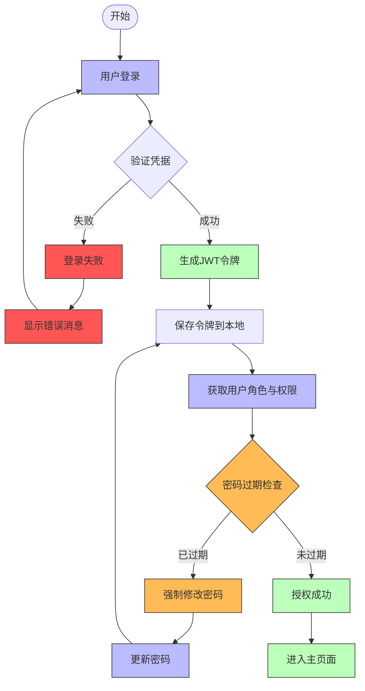
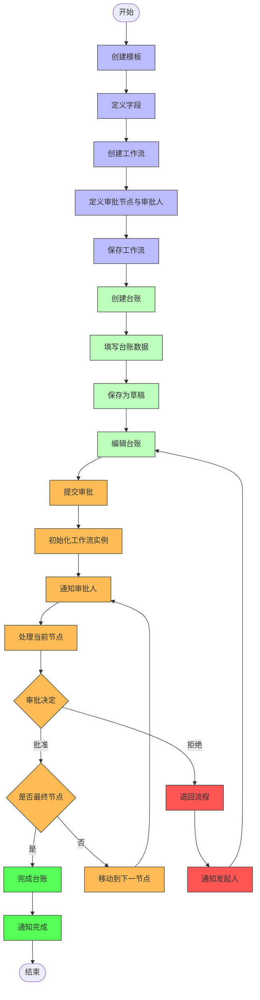
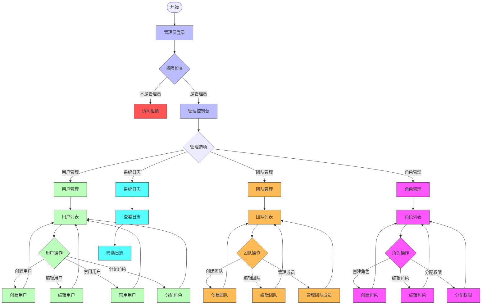

# 业务流程图

## 1. 用户认证与授权流程

```mermaid
flowchart TB
    Start([开始]) --> Login[用户登录]
    Login --> CheckCred{验证凭据}
    
    CheckCred -->|成功| GenerateToken[生成JWT令牌]
    CheckCred -->|失败| LoginFail[登录失败]
    LoginFail --> FailureNotification[显示错误消息]
    FailureNotification --> Login
    
    GenerateToken --> StoreToken[保存令牌到本地]
    StoreToken --> RetrieveUserRole[获取用户角色与权限]
    RetrieveUserRole --> CheckExpired{密码过期检查}
    
    CheckExpired -->|已过期| PasswordChange[强制修改密码]
    CheckExpired -->|未过期| Authorized[授权成功]
    PasswordChange --> UpdatePassword[更新密码]
    UpdatePassword --> StoreToken
    
    Authorized --> Dashboard[进入主页面]
    
    %% 状态样式
    classDef success fill:#bfb,stroke:#333;
    classDef warning fill:#fb5,stroke:#333;
    classDef error fill:#f55,stroke:#333;
    classDef process fill:#bbf,stroke:#333;
    
    class GenerateToken,Authorized,Dashboard success;
    class LoginFail,FailureNotification error;
    class CheckExpired,PasswordChange warning;
    class Login,RetrieveUserRole,UpdatePassword process;
```

## 2. 台账管理流程

```mermaid
flowchart TB
    Start([开始]) --> CreateTemplate[创建模板]
    CreateTemplate --> DefineFields[定义字段]
    DefineFields --> CreateWorkflow[创建工作流]
    CreateWorkflow --> DefineApprovers[定义审批节点与审批人]
    DefineApprovers --> SaveWorkflow[保存工作流]
    
    SaveWorkflow --> CreateLedger[创建台账]
    CreateLedger --> FillData[填写台账数据]
    FillData --> SaveDraft[保存为草稿]
    
    SaveDraft --> EditLedger[编辑台账]
    EditLedger --> SubmitForApproval[提交审批]
    
    SubmitForApproval --> InitWorkflow[初始化工作流实例]
    InitWorkflow --> NotifyApprovers[通知审批人]
    
    NotifyApprovers --> ProcessNode[处理当前节点]
    ProcessNode --> ApproveDecision{审批决定}
    
    ApproveDecision -->|批准| IsFinalNode{是否最终节点}
    ApproveDecision -->|拒绝| RejectProcess[退回流程]
    
    IsFinalNode -->|是| CompleteLedger[完成台账]
    IsFinalNode -->|否| MoveToNextNode[移动到下一节点]
    MoveToNextNode --> NotifyApprovers
    
    RejectProcess --> NotifyReject[通知发起人]
    NotifyReject --> EditLedger
    
    CompleteLedger --> NotifyCompletion[通知完成]
    NotifyCompletion --> End([结束])
    
    %% 状态样式
    classDef setup fill:#bbf,stroke:#333;
    classDef create fill:#bfb,stroke:#333;
    classDef approval fill:#fb5,stroke:#333;
    classDef reject fill:#f55,stroke:#333;
    classDef complete fill:#5f5,stroke:#333;
    
    class CreateTemplate,DefineFields,CreateWorkflow,DefineApprovers,SaveWorkflow setup;
    class CreateLedger,FillData,SaveDraft,EditLedger create;
    class SubmitForApproval,InitWorkflow,NotifyApprovers,ProcessNode,ApproveDecision,IsFinalNode,MoveToNextNode approval;
    class RejectProcess,NotifyReject reject;
    class CompleteLedger,NotifyCompletion complete;
```

## 3. 管理员功能流程

```mermaid
flowchart TB
    Start([开始]) --> AdminLogin[管理员登录]
    AdminLogin --> CheckAdmin{权限检查}
    
    CheckAdmin -->|不是管理员| AccessDenied[访问拒绝]
    CheckAdmin -->|是管理员| AdminDashboard[管理控制台]
    
    AdminDashboard --> ManagementOptions{管理选项}
    
    ManagementOptions -->|用户管理| UserManagement[用户管理]
    ManagementOptions -->|团队管理| TeamManagement[团队管理]
    ManagementOptions -->|角色管理| RoleManagement[角色管理]
    ManagementOptions -->|系统日志| SystemLogs[系统日志]
    
    UserManagement --> ListUsers[用户列表]
    ListUsers --> UserOptions{用户操作}
    UserOptions -->|创建用户| CreateUser[创建用户]
    UserOptions -->|编辑用户| EditUser[编辑用户]
    UserOptions -->|禁用用户| DisableUser[禁用用户]
    UserOptions -->|分配角色| AssignRole[分配角色]
    
    TeamManagement --> ListTeams[团队列表]
    ListTeams --> TeamOptions{团队操作}
    TeamOptions -->|创建团队| CreateTeam[创建团队]
    TeamOptions -->|编辑团队| EditTeam[编辑团队]
    TeamOptions -->|管理成员| ManageMembers[管理团队成员]
    
    RoleManagement --> ListRoles[角色列表]
    ListRoles --> RoleOptions{角色操作}
    RoleOptions -->|创建角色| CreateRole[创建角色]
    RoleOptions -->|编辑角色| EditRole[编辑角色]
    RoleOptions -->|分配权限| AssignPermissions[分配权限]
    
    SystemLogs --> ViewLogs[查看日志]
    ViewLogs --> FilterLogs[筛选日志]
    
    CreateUser --> ListUsers
    EditUser --> ListUsers
    DisableUser --> ListUsers
    AssignRole --> ListUsers
    
    CreateTeam --> ListTeams
    EditTeam --> ListTeams
    ManageMembers --> ListTeams
    
    CreateRole --> ListRoles
    EditRole --> ListRoles
    AssignPermissions --> ListRoles
    
    %% 状态样式
    classDef admin fill:#bbf,stroke:#333;
    classDef user fill:#bfb,stroke:#333;
    classDef team fill:#fb5,stroke:#333;
    classDef role fill:#f5f,stroke:#333;
    classDef log fill:#5ff,stroke:#333;
    classDef error fill:#f55,stroke:#333;
    
    class AdminLogin,AdminDashboard,CheckAdmin admin;
    class UserManagement,ListUsers,UserOptions,CreateUser,EditUser,DisableUser,AssignRole user;
    class TeamManagement,ListTeams,TeamOptions,CreateTeam,EditTeam,ManageMembers team;
    class RoleManagement,ListRoles,RoleOptions,CreateRole,EditRole,AssignPermissions role;
    class SystemLogs,ViewLogs,FilterLogs log;
    class AccessDenied error;
``` 