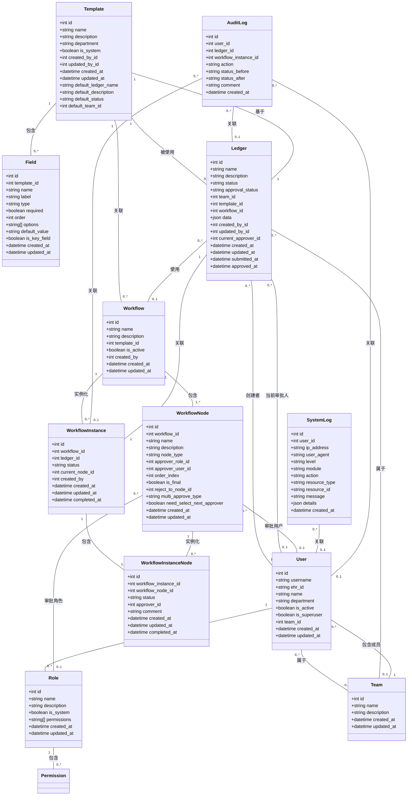

# 数据模型关系图

```mermaid
classDiagram
    %% 用户与权限管理
    User "1" -- "0..*" Role : 拥有
    User "0..*" -- "0..1" Team : 属于
    Team "1" -- "0..*" User : 包含成员
    Role "1" -- "0..*" Permission : 包含

    %% 模板相关
    Template "1" -- "0..*" Field : 包含
    Template "1" -- "0..*" Ledger : 被使用
    Template "1" -- "0..*" Workflow : 关联

    %% 台账相关
    Ledger "1" -- "1" Template : 基于
    Ledger "0..*" -- "0..1" Team : 属于
    Ledger "0..*" -- "0..1" Workflow : 使用
    Ledger "0..*" -- "1" User : 创建者
    Ledger "0..*" -- "0..1" User : 当前审批人

    %% 工作流相关
    Workflow "1" -- "1..*" WorkflowNode : 包含
    Workflow "1" -- "0..*" WorkflowInstance : 实例化
    WorkflowInstance "1" -- "1" Ledger : 关联
    WorkflowInstance "1" -- "1..*" WorkflowInstanceNode : 包含
    WorkflowNode "1" -- "0..*" WorkflowInstanceNode : 实例化
    WorkflowNode "0..*" -- "0..1" Role : 审批角色
    WorkflowNode "0..*" -- "0..1" User : 审批用户

    %% 日志相关
    SystemLog "0..*" -- "0..1" User : 关联
    AuditLog "0..*" -- "0..1" User : 关联
    AuditLog "0..*" -- "0..1" Ledger : 关联
    AuditLog "0..*" -- "0..1" WorkflowInstance : 关联

    %% 类定义
    class User {
        +int id
        +string username
        +string ehr_id
        +string name
        +string department
        +boolean is_active
        +boolean is_superuser
        +int team_id
        +datetime created_at
        +datetime updated_at
    }

    class Team {
        +int id
        +string name
        +string description
        +datetime created_at
        +datetime updated_at
    }

    class Role {
        +int id
        +string name
        +string description
        +boolean is_system
        +string[] permissions
        +datetime created_at
        +datetime updated_at
    }

    class Template {
        +int id
        +string name
        +string description
        +string department
        +boolean is_system
        +int created_by_id
        +int updated_by_id
        +datetime created_at
        +datetime updated_at
        +string default_ledger_name
        +string default_description
        +string default_status
        +int default_team_id
    }

    class Field {
        +int id
        +int template_id
        +string name
        +string label
        +string type
        +boolean required
        +int order
        +string[] options
        +string default_value
        +boolean is_key_field
        +datetime created_at
        +datetime updated_at
    }

    class Ledger {
        +int id
        +string name
        +string description
        +string status
        +string approval_status
        +int team_id
        +int template_id
        +int workflow_id
        +json data
        +int created_by_id
        +int updated_by_id
        +int current_approver_id
        +datetime created_at
        +datetime updated_at
        +datetime submitted_at
        +datetime approved_at
    }

    class Workflow {
        +int id
        +string name
        +string description
        +int template_id
        +boolean is_active
        +int created_by
        +datetime created_at
        +datetime updated_at
    }

    class WorkflowNode {
        +int id
        +int workflow_id
        +string name
        +string description
        +string node_type
        +int approver_role_id
        +int approver_user_id
        +int order_index
        +boolean is_final
        +int reject_to_node_id
        +string multi_approve_type
        +boolean need_select_next_approver
        +datetime created_at
        +datetime updated_at
    }

    class WorkflowInstance {
        +int id
        +int workflow_id
        +int ledger_id
        +string status
        +int current_node_id
        +int created_by
        +datetime created_at
        +datetime updated_at
        +datetime completed_at
    }

    class WorkflowInstanceNode {
        +int id
        +int workflow_instance_id
        +int workflow_node_id
        +string status
        +int approver_id
        +string comment
        +datetime created_at
        +datetime updated_at
        +datetime completed_at
    }

    class SystemLog {
        +int id
        +int user_id
        +string ip_address
        +string user_agent
        +string level
        +string module
        +string action
        +string resource_type
        +string resource_id
        +string message
        +json details
        +datetime created_at
    }

    class AuditLog {
        +int id
        +int user_id
        +int ledger_id
        +int workflow_instance_id
        +string action
        +string status_before
        +string status_after
        +string comment
        +datetime created_at
    }
``` 