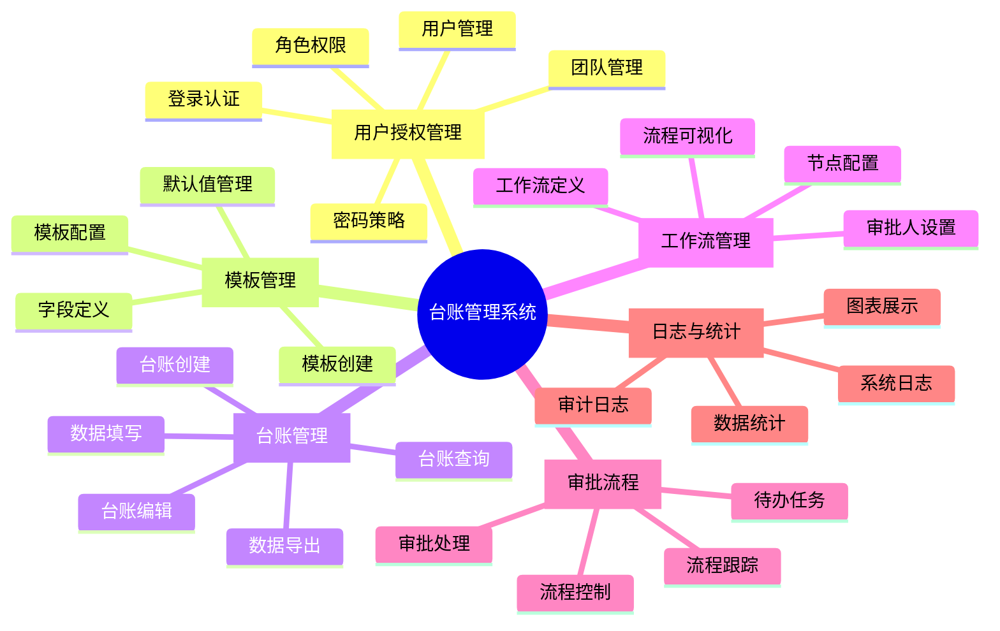
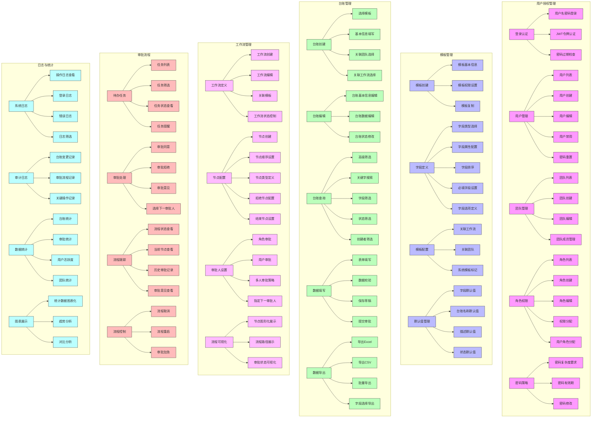

# 系统功能总结

## 主要功能模块概览

```mermaid
mindmap
  root((台账管理系统))
    [用户授权管理]
      登录认证
      用户管理
      团队管理
      角色权限
      密码策略
    [模板管理]
      模板创建
      字段定义
      模板配置
      默认值管理
    [台账管理]
      台账创建
      台账编辑
      台账查询
      数据填写
      数据导出
    [工作流管理]
      工作流定义
      节点配置
      审批人设置
      流程可视化
    [审批流程]
      待办任务
      审批处理
      流程跟踪
      流程控制
    [日志与统计]
      系统日志
      审计日志
      数据统计
      图表展示
```

## 详细功能清单

```mermaid
graph TD
    %% 用户授权管理模块
    subgraph "用户授权管理"
        A1[登录认证] --> A11[用户名密码登录]
        A1 --> A12[JWT令牌认证]
        A1 --> A13[密码过期检查]
        
        A2[用户管理] --> A21[用户列表]
        A2 --> A22[用户创建]
        A2 --> A23[用户编辑]
        A2 --> A24[用户禁用]
        A2 --> A25[密码重置]
        
        A3[团队管理] --> A31[团队列表]
        A3 --> A32[团队创建]
        A3 --> A33[团队编辑]
        A3 --> A34[团队成员管理]
        
        A4[角色权限] --> A41[角色列表]
        A4 --> A42[角色创建]
        A4 --> A43[角色编辑]
        A4 --> A44[权限分配]
        A4 --> A45[用户角色分配]
        
        A5[密码策略] --> A51[密码复杂度要求]
        A5 --> A52[密码有效期]
        A5 --> A53[密码修改]
    end
    
    %% 模板管理模块
    subgraph "模板管理"
        B1[模板创建] --> B11[模板基本信息]
        B1 --> B12[模板权限设置]
        B1 --> B13[模板复制]
        
        B2[字段定义] --> B21[字段类型选择]
        B2 --> B22[字段属性配置]
        B2 --> B23[字段排序]
        B2 --> B24[必填字段设置]
        B2 --> B25[字段选项定义]
        
        B3[模板配置] --> B31[关联工作流]
        B3 --> B32[关联团队]
        B3 --> B33[系统模板标记]
        
        B4[默认值管理] --> B41[字段默认值]
        B4 --> B42[台账名称默认值]
        B4 --> B43[描述默认值]
        B4 --> B44[状态默认值]
    end
    
    %% 台账管理模块
    subgraph "台账管理"
        C1[台账创建] --> C11[选择模板]
        C1 --> C12[基本信息填写]
        C1 --> C13[关联团队选择]
        C1 --> C14[关联工作流选择]
        
        C2[台账编辑] --> C21[台账基本信息编辑]
        C2 --> C22[台账数据编辑]
        C2 --> C23[台账状态修改]
        
        C3[台账查询] --> C31[高级筛选]
        C3 --> C32[关键字搜索]
        C3 --> C33[字段筛选]
        C3 --> C34[状态筛选]
        C3 --> C35[创建者筛选]
        
        C4[数据填写] --> C41[表单填写]
        C4 --> C42[数据校验]
        C4 --> C43[保存草稿]
        C4 --> C44[提交审批]
        
        C5[数据导出] --> C51[导出Excel]
        C5 --> C52[导出CSV]
        C5 --> C53[批量导出]
        C5 --> C54[字段选择导出]
    end
    
    %% 工作流管理模块
    subgraph "工作流管理"
        D1[工作流定义] --> D11[工作流创建]
        D1 --> D12[工作流编辑]
        D1 --> D13[关联模板]
        D1 --> D14[工作流状态控制]
        
        D2[节点配置] --> D21[节点创建]
        D2 --> D22[节点顺序设置]
        D2 --> D23[节点类型定义]
        D2 --> D24[拒绝节点配置]
        D2 --> D25[结束节点设置]
        
        D3[审批人设置] --> D31[角色审批]
        D3 --> D32[用户审批]
        D3 --> D33[多人审批策略]
        D3 --> D34[指定下一审批人]
        
        D4[流程可视化] --> D41[节点图形化展示]
        D4 --> D42[流程路径展示]
        D4 --> D43[审批状态可视化]
    end
    
    %% 审批流程模块
    subgraph "审批流程"
        E1[待办任务] --> E11[任务列表]
        E1 --> E12[任务筛选]
        E1 --> E13[任务状态查看]
        E1 --> E14[任务提醒]
        
        E2[审批处理] --> E21[审批同意]
        E2 --> E22[审批拒绝]
        E2 --> E23[审批意见]
        E2 --> E24[选择下一审批人]
        
        E3[流程跟踪] --> E31[流程状态查看]
        E3 --> E32[当前节点查看]
        E3 --> E33[历史审批记录]
        E3 --> E34[审批意见查看]
        
        E4[流程控制] --> E41[流程取消]
        E4 --> E42[流程重启]
        E4 --> E43[审批加急]
    end
    
    %% 日志与统计模块
    subgraph "日志与统计"
        F1[系统日志] --> F11[操作日志查看]
        F1 --> F12[登录日志]
        F1 --> F13[错误日志]
        F1 --> F14[日志筛选]
        
        F2[审计日志] --> F21[台账变更记录]
        F2 --> F22[审批流程记录]
        F2 --> F23[关键操作记录]
        
        F3[数据统计] --> F31[台账统计]
        F3 --> F32[审批统计]
        F3 --> F33[用户活跃度]
        F3 --> F34[团队统计]
        
        F4[图表展示] --> F41[统计数据图表化]
        F4 --> F42[趋势分析]
        F4 --> F43[对比分析]
    end
    
    %% 全局样式
    classDef user fill:#f9f,stroke:#333,stroke-width:1px;
    classDef template fill:#bbf,stroke:#333,stroke-width:1px;
    classDef ledger fill:#bfb,stroke:#333,stroke-width:1px;
    classDef workflow fill:#fbf,stroke:#333,stroke-width:1px;
    classDef approval fill:#fbb,stroke:#333,stroke-width:1px;
    classDef log fill:#bff,stroke:#333,stroke-width:1px;
    
    class A1,A11,A12,A13,A2,A21,A22,A23,A24,A25,A3,A31,A32,A33,A34,A4,A41,A42,A43,A44,A45,A5,A51,A52,A53 user;
    class B1,B11,B12,B13,B2,B21,B22,B23,B24,B25,B3,B31,B32,B33,B4,B41,B42,B43,B44 template;
    class C1,C11,C12,C13,C14,C2,C21,C22,C23,C3,C31,C32,C33,C34,C35,C4,C41,C42,C43,C44,C5,C51,C52,C53,C54 ledger;
    class D1,D11,D12,D13,D14,D2,D21,D22,D23,D24,D25,D3,D31,D32,D33,D34,D4,D41,D42,D43 workflow;
    class E1,E11,E12,E13,E14,E2,E21,E22,E23,E24,E3,E31,E32,E33,E34,E4,E41,E42,E43 approval;
    class F1,F11,F12,F13,F14,F2,F21,F22,F23,F3,F31,F32,F33,F34,F4,F41,F42,F43 log;
``` 