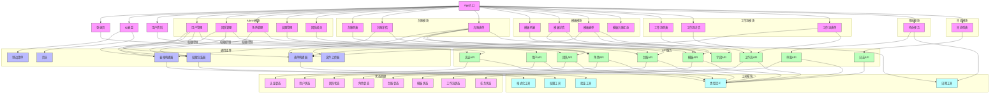
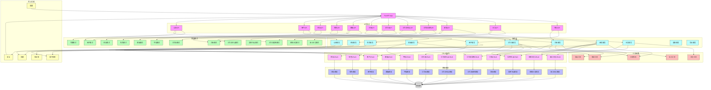

# 模块交互关系图

## 前端模块交互

```mermaid
graph TB
    %% 前端核心模块
    App[App入口]
    
    %% 页面模块
    Login[登录页]
    Dashboard[仪表盘]
    UserProfile[用户资料]
    
    %% 功能分组
    subgraph "Admin模块"
        UserManagement[用户管理]
        TeamManagement[团队管理]
        RoleManagement[角色管理]
        PermissionManagement[权限管理]
        TeamMembers[团队成员]
    end
    
    subgraph "台账模块"
        LedgerList[台账列表]
        LedgerDetail[台账详情]
        LedgerForm[台账表单]
    end
    
    subgraph "模板模块"
        TemplateList[模板列表]
        TemplateDetail[模板详情]
        TemplateForm[模板表单]
        TemplateLedgerSummary[模板台账汇总]
    end
    
    subgraph "工作流模块"
        WorkflowList[工作流列表]
        WorkflowDetail[工作流详情]
        WorkflowForm[工作流表单]
    end
    
    subgraph "审批模块"
        TaskList[待办任务]
    end
    
    subgraph "日志模块"
        LogList[日志列表]
    end
    
    %% 共享组件
    subgraph "通用组件"
        SideMenu[侧边菜单]
        Header[页头]
        AuthWrapper[权限包装器]
        FormBuilder[表单构建器]
        TableBuilder[表格构建器]
        FileUploader[文件上传器]
    end
    
    %% API模块
    subgraph "API服务"
        API_Auth[认证API]
        API_User[用户API]
        API_Team[团队API]
        API_Role[角色API]
        API_Template[模板API]
        API_Field[字段API]
        API_Ledger[台账API]
        API_Workflow[工作流API]
        API_Approval[审批API]
        API_Log[日志API]
    end
    
    %% 数据状态模块
    subgraph "状态管理"
        Store_Auth[认证状态]
        Store_User[用户状态]
        Store_Team[团队状态]
        Store_Role[角色状态]
        Store_Template[模板状态]
        Store_Ledger[台账状态]
        Store_Workflow[工作流状态]
        Store_Task[任务状态]
    end
    
    %% 工具函数
    subgraph "工具模块"
        TypeDefinitions[类型定义]
        ValidationUtils[验证工具]
        FormatUtils[格式化工具]
        DateUtils[日期工具]
        AuthUtils[权限工具]
    end
    
    %% 路由关系
    App --> Login
    App --> Dashboard
    App --> UserProfile
    App --> UserManagement
    App --> TeamManagement
    App --> RoleManagement
    App --> PermissionManagement
    App --> TeamMembers
    App --> LedgerList
    App --> LedgerDetail
    App --> LedgerForm
    App --> TemplateList
    App --> TemplateDetail
    App --> TemplateForm
    App --> TemplateLedgerSummary
    App --> WorkflowList
    App --> WorkflowDetail
    App --> WorkflowForm
    App --> TaskList
    App --> LogList
    
    %% 通用组件使用关系
    Dashboard --> SideMenu
    Dashboard --> Header
    UserManagement --> TableBuilder
    UserManagement --> FormBuilder
    TeamManagement --> TableBuilder
    TemplateForm --> FormBuilder
    WorkflowForm --> FormBuilder
    LedgerForm --> FormBuilder
    LedgerForm --> FileUploader
    LedgerDetail --> TableBuilder
    
    %% 权限控制
    UserManagement -- 权限控制 --> AuthWrapper
    TeamManagement -- 权限控制 --> AuthWrapper
    RoleManagement -- 权限控制 --> AuthWrapper
    
    %% API调用关系
    Login --> API_Auth
    UserProfile --> API_Auth
    UserManagement --> API_User
    TeamManagement --> API_Team
    TeamMembers --> API_Team
    RoleManagement --> API_Role
    PermissionManagement --> API_Role
    TemplateList --> API_Template
    TemplateDetail --> API_Template
    TemplateDetail --> API_Field
    TemplateForm --> API_Template
    TemplateForm --> API_Field
    LedgerList --> API_Ledger
    LedgerDetail --> API_Ledger
    LedgerForm --> API_Ledger
    LedgerForm --> API_Template
    WorkflowList --> API_Workflow
    WorkflowDetail --> API_Workflow
    WorkflowForm --> API_Workflow
    TaskList --> API_Approval
    LogList --> API_Log
    
    %% 状态管理
    API_Auth --> Store_Auth
    API_User --> Store_User
    API_Team --> Store_Team
    API_Role --> Store_Role
    API_Template --> Store_Template
    API_Ledger --> Store_Ledger
    API_Workflow --> Store_Workflow
    API_Approval --> Store_Task
    
    %% 工具使用
    API_Auth --> TypeDefinitions
    API_User --> TypeDefinitions
    API_Team --> TypeDefinitions
    API_Role --> TypeDefinitions
    API_Template --> TypeDefinitions
    API_Ledger --> TypeDefinitions
    API_Workflow --> TypeDefinitions
    API_Approval --> TypeDefinitions
    API_Log --> TypeDefinitions
    
    FormBuilder --> ValidationUtils
    TableBuilder --> FormatUtils
    LedgerForm --> DateUtils
    TaskList --> DateUtils
    AuthWrapper --> AuthUtils
    
    classDef page fill:#f9f,stroke:#333,stroke-width:1px;
    classDef component fill:#bbf,stroke:#333,stroke-width:1px;
    classDef api fill:#bfb,stroke:#333,stroke-width:1px;
    classDef store fill:#fbf,stroke:#333,stroke-width:1px;
    classDef util fill:#bff,stroke:#333,stroke-width:1px;
    
    class App,Login,Dashboard,UserProfile,UserManagement,TeamManagement,RoleManagement,PermissionManagement,TeamMembers,LedgerList,LedgerDetail,LedgerForm,TemplateList,TemplateDetail,TemplateForm,TemplateLedgerSummary,WorkflowList,WorkflowDetail,WorkflowForm,TaskList,LogList page;
    class SideMenu,Header,AuthWrapper,FormBuilder,TableBuilder,FileUploader component;
    class API_Auth,API_User,API_Team,API_Role,API_Template,API_Field,API_Ledger,API_Workflow,API_Approval,API_Log api;
    class Store_Auth,Store_User,Store_Team,Store_Role,Store_Template,Store_Ledger,Store_Workflow,Store_Task store;
    class TypeDefinitions,ValidationUtils,FormatUtils,DateUtils,AuthUtils util;
```

## 后端模块交互

```mermaid
graph TB
    %% 后端核心模块
    FastAPI[FastAPI App]
    
    %% API端点
    subgraph "API端点"
        Auth[认证API]
        Users[用户API]
        Teams[团队API]
        Roles[角色API]
        Templates[模板API]
        Ledgers[台账API]
        Workflows[工作流API]
        WorkflowNodes[工作流节点API]
        WorkflowInstances[工作流实例API]
        Approvals[审批API]
        Logs[日志API]
        Statistics[统计API]
    end
    
    %% 数据模型
    subgraph "数据模型"
        Model_User[用户模型]
        Model_Team[团队模型]
        Model_Role[角色模型]
        Model_Template[模板模型]
        Model_Field[字段模型]
        Model_Ledger[台账模型]
        Model_Workflow[工作流模型]
        Model_WorkflowNode[工作流节点模型]
        Model_WorkflowInstance[工作流实例模型]
        Model_WorkflowInstanceNode[实例节点模型]
        Model_SystemLog[系统日志模型]
        Model_AuditLog[审计日志模型]
    end
    
    %% 数据模式
    subgraph "数据模式"
        Schema_User[用户模式]
        Schema_Team[团队模式]
        Schema_Role[角色模式]
        Schema_Template[模板模式]
        Schema_Field[字段模式]
        Schema_Ledger[台账模式]
        Schema_Workflow[工作流模式]
        Schema_WorkflowNode[工作流节点模式]
        Schema_WorkflowInstance[工作流实例模式]
        Schema_WorkflowInstanceNode[实例节点模式]
        Schema_SystemLog[系统日志模式]
        Schema_AuditLog[审计日志模式]
        Schema_Token[令牌模式]
    end
    
    %% CRUD操作
    subgraph "CRUD操作"
        CRUD_User[用户CRUD]
        CRUD_Team[团队CRUD]
        CRUD_Role[角色CRUD]
        CRUD_Template[模板CRUD]
        CRUD_Field[字段CRUD]
        CRUD_Ledger[台账CRUD]
        CRUD_Workflow[工作流CRUD]
        CRUD_WorkflowNode[工作流节点CRUD]
        CRUD_WorkflowInstance[工作流实例CRUD]
        CRUD_WorkflowInstanceNode[实例节点CRUD]
        CRUD_SystemLog[系统日志CRUD]
        CRUD_AuditLog[审计日志CRUD]
    end
    
    %% 服务层
    subgraph "服务层"
        Service_Auth[认证服务]
        Service_User[用户服务]
        Service_Team[团队服务]
        Service_Role[角色服务]
        Service_Template[模板服务]
        Service_Ledger[台账服务]
        Service_Workflow[工作流服务]
        Service_Approval[审批服务]
        Service_Log[日志服务]
        Service_Notification[通知服务]
        Service_Export[导出服务]
    end
    
    %% 核心功能
    subgraph "核心功能"
        Core_Config[配置]
        Core_Security[安全]
        Core_Permissions[权限]
        Core_Validators[验证器]
        Core_Events[事件系统]
    end
    
    %% 工具函数
    subgraph "工具函数"
        Utils_Date[日期工具]
        Utils_Export[导出工具]
        Utils_Import[导入工具]
        Utils_Validation[验证工具]
        Utils_Logger[日志工具]
    end
    
    %% 数据库
    DB[(数据库)]
    
    %% 路由关系
    FastAPI --> Auth
    FastAPI --> Users
    FastAPI --> Teams
    FastAPI --> Roles
    FastAPI --> Templates
    FastAPI --> Ledgers
    FastAPI --> Workflows
    FastAPI --> WorkflowNodes
    FastAPI --> WorkflowInstances
    FastAPI --> Approvals
    FastAPI --> Logs
    FastAPI --> Statistics
    
    %% API与服务层关系
    Auth --> Service_Auth
    Users --> Service_User
    Teams --> Service_Team
    Roles --> Service_Role
    Templates --> Service_Template
    Ledgers --> Service_Ledger
    Workflows --> Service_Workflow
    WorkflowNodes --> Service_Workflow
    WorkflowInstances --> Service_Workflow
    Approvals --> Service_Approval
    Logs --> Service_Log
    Statistics --> Service_Ledger
    Statistics --> Service_User
    
    %% 服务层与CRUD关系
    Service_Auth --> CRUD_User
    Service_User --> CRUD_User
    Service_Team --> CRUD_Team
    Service_Role --> CRUD_Role
    Service_Template --> CRUD_Template
    Service_Template --> CRUD_Field
    Service_Ledger --> CRUD_Ledger
    Service_Workflow --> CRUD_Workflow
    Service_Workflow --> CRUD_WorkflowNode
    Service_Workflow --> CRUD_WorkflowInstance
    Service_Workflow --> CRUD_WorkflowInstanceNode
    Service_Approval --> CRUD_Ledger
    Service_Approval --> CRUD_WorkflowInstance
    Service_Approval --> CRUD_WorkflowInstanceNode
    Service_Approval --> CRUD_AuditLog
    Service_Log --> CRUD_SystemLog
    Service_Log --> CRUD_AuditLog
    
    %% CRUD与模型关系
    CRUD_User --> Model_User
    CRUD_Team --> Model_Team
    CRUD_Role --> Model_Role
    CRUD_Template --> Model_Template
    CRUD_Field --> Model_Field
    CRUD_Ledger --> Model_Ledger
    CRUD_Workflow --> Model_Workflow
    CRUD_WorkflowNode --> Model_WorkflowNode
    CRUD_WorkflowInstance --> Model_WorkflowInstance
    CRUD_WorkflowInstanceNode --> Model_WorkflowInstanceNode
    CRUD_SystemLog --> Model_SystemLog
    CRUD_AuditLog --> Model_AuditLog
    
    %% 模型与数据库关系
    Model_User --> DB
    Model_Team --> DB
    Model_Role --> DB
    Model_Template --> DB
    Model_Field --> DB
    Model_Ledger --> DB
    Model_Workflow --> DB
    Model_WorkflowNode --> DB
    Model_WorkflowInstance --> DB
    Model_WorkflowInstanceNode --> DB
    Model_SystemLog --> DB
    Model_AuditLog --> DB
    
    %% API与模式关系
    Auth --> Schema_Token
    Auth --> Schema_User
    Users --> Schema_User
    Teams --> Schema_Team
    Roles --> Schema_Role
    Templates --> Schema_Template
    Templates --> Schema_Field
    Ledgers --> Schema_Ledger
    Workflows --> Schema_Workflow
    WorkflowNodes --> Schema_WorkflowNode
    WorkflowInstances --> Schema_WorkflowInstance
    Approvals --> Schema_Ledger
    Approvals --> Schema_WorkflowInstance
    Logs --> Schema_SystemLog
    Logs --> Schema_AuditLog
    
    %% 核心功能与服务关系
    Service_Auth --> Core_Security
    Service_User --> Core_Permissions
    Service_Role --> Core_Permissions
    Service_Ledger --> Core_Validators
    Service_Workflow --> Core_Events
    Service_Approval --> Core_Events
    Service_Log --> Utils_Logger
    
    %% 工具函数使用
    Service_Ledger --> Utils_Export
    Service_Ledger --> Utils_Import
    Service_Ledger --> Utils_Validation
    Service_Template --> Utils_Validation
    Service_Workflow --> Utils_Date
    Service_Approval --> Utils_Date
    
    %% 通用依赖
    Core_Config --> FastAPI
    Core_Security --> FastAPI
    
    classDef api fill:#f9f,stroke:#333,stroke-width:1px;
    classDef model fill:#bbf,stroke:#333,stroke-width:1px;
    classDef schema fill:#bfb,stroke:#333,stroke-width:1px;
    classDef crud fill:#fbf,stroke:#333,stroke-width:1px;
    classDef service fill:#bff,stroke:#333,stroke-width:1px;
    classDef core fill:#ffb,stroke:#333,stroke-width:1px;
    classDef util fill:#fbb,stroke:#333,stroke-width:1px;
    classDef db fill:#ddd,stroke:#333,stroke-width:1px;
    
    class FastAPI,Auth,Users,Teams,Roles,Templates,Ledgers,Workflows,WorkflowNodes,WorkflowInstances,Approvals,Logs,Statistics api;
    class Model_User,Model_Team,Model_Role,Model_Template,Model_Field,Model_Ledger,Model_Workflow,Model_WorkflowNode,Model_WorkflowInstance,Model_WorkflowInstanceNode,Model_SystemLog,Model_AuditLog model;
    class Schema_User,Schema_Team,Schema_Role,Schema_Template,Schema_Field,Schema_Ledger,Schema_Workflow,Schema_WorkflowNode,Schema_WorkflowInstance,Schema_WorkflowInstanceNode,Schema_SystemLog,Schema_AuditLog,Schema_Token schema;
    class CRUD_User,CRUD_Team,CRUD_Role,CRUD_Template,CRUD_Field,CRUD_Ledger,CRUD_Workflow,CRUD_WorkflowNode,CRUD_WorkflowInstance,CRUD_WorkflowInstanceNode,CRUD_SystemLog,CRUD_AuditLog crud;
    class Service_Auth,Service_User,Service_Team,Service_Role,Service_Template,Service_Ledger,Service_Workflow,Service_Approval,Service_Log,Service_Notification,Service_Export service;
    class Core_Config,Core_Security,Core_Permissions,Core_Validators,Core_Events core;
    class Utils_Date,Utils_Export,Utils_Import,Utils_Validation,Utils_Logger util;
    class DB db;
``` 