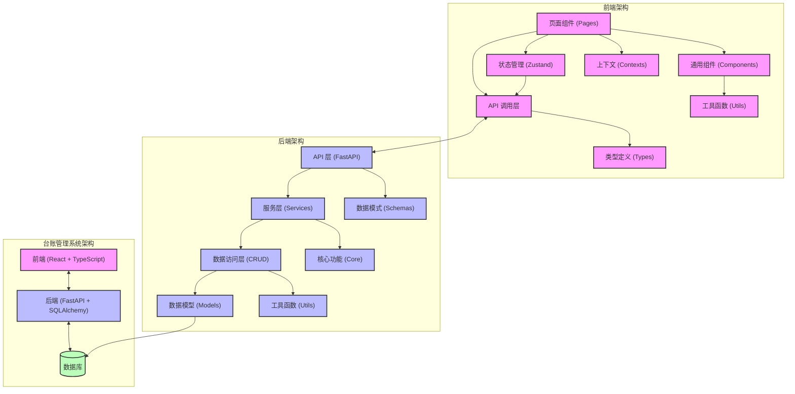

# 系统架构图

```mermaid
graph TB
    %% 整体系统架构
    subgraph "台账管理系统架构"
        Frontend["前端 (React + TypeScript)"]
        Backend["后端 (FastAPI + SQLAlchemy)"]
        Database[(数据库)]
    end

    %% 前端架构
    subgraph "前端架构"
        direction TB
        FE_Pages["页面组件 (Pages)"]
        FE_Components["通用组件 (Components)"]
        FE_API["API 调用层"]
        FE_Stores["状态管理 (Zustand)"]
        FE_Utils["工具函数 (Utils)"]
        FE_Types["类型定义 (Types)"]
        FE_Contexts["上下文 (Contexts)"]
    end

    %% 后端架构
    subgraph "后端架构"
        direction TB
        BE_API["API 层 (FastAPI)"]
        BE_Services["服务层 (Services)"]
        BE_CRUD["数据访问层 (CRUD)"]
        BE_Models["数据模型 (Models)"]
        BE_Schemas["数据模式 (Schemas)"]
        BE_Core["核心功能 (Core)"]
        BE_Utils["工具函数 (Utils)"]
    end

    %% 连接关系
    Frontend <--> Backend
    Backend <--> Database
    
    %% 前端内部连接
    FE_Pages --> FE_Components
    FE_Pages --> FE_API
    FE_Pages --> FE_Stores
    FE_Components --> FE_Utils
    FE_API --> FE_Types
    FE_Stores --> FE_API
    FE_Pages --> FE_Contexts
    
    %% 后端内部连接
    BE_API --> BE_Services
    BE_Services --> BE_CRUD
    BE_CRUD --> BE_Models
    BE_API --> BE_Schemas
    BE_Models --> Database
    BE_Services --> BE_Core
    BE_CRUD --> BE_Utils
    
    %% 前后端连接
    FE_API <--> BE_API
    
    %% 说明
    classDef frontend fill:#f9f,stroke:#333,stroke-width:2px;
    classDef backend fill:#bbf,stroke:#333,stroke-width:2px;
    classDef database fill:#bfb,stroke:#333,stroke-width:2px;
    
    class Frontend,FE_Pages,FE_Components,FE_API,FE_Stores,FE_Utils,FE_Types,FE_Contexts frontend;
    class Backend,BE_API,BE_Services,BE_CRUD,BE_Models,BE_Schemas,BE_Core,BE_Utils backend;
    class Database database;
``` 